# Установка Python и запуск веб-сервера Flask
1. [Установка и настройка Python](#установка-и-настройка-python)
	1. [Сборка Python из исходников](#сборка-python-из-исходников)
	2. [Запуск простого веб-приложения](#запуск-простого-веб-приложения)
2. [NGINX](#nginx)
	1. [Установка веб-сервера NGINX](#установка-веб-сервера-nginx)
	2. [Управление конфигурацией веб-сервера NGINX](#управление-конфигурацией-веб-сервера-nginx)
3. [Установка и запуск WSGI-сервера](#установка-и-запуск-wsgi-сервера)
4. [Использование СУБД для хранения информации](#использование-субд-для-хранения-информации)

---

##### Цель работы:
>Получить навыки по установке и сборке из исходного кода пакетов в Linux, запуску веб-приложений Flask.

---

## Установка и настройка Python
### Сборка Python из исходников

Python может быть включен в состав установленного дистрибутива Linux. Проверить это можно, например, командой:

```bash
python3 --version
```

или

```bash
python3 -V
```

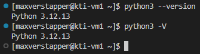

Как мы видим, у нас уже установлен Python версии 3.12.13 (версия может отличаться в зависимости от актуального образа Rocky Linux на момент установки).

Обновить Python можно несколькими способами: скачать новый пакет из репозитория или собрать самостоятельно из исходников. В целях расширения кругозора выберем второй способ.

Прежде чем собирать пакет из исходников, установим некоторое вспомогательное ПО с помощью команды:

```bash
sudo dnf install gcc make zlib-devel bzip2-devel openssl-devel xz-devel libffi-devel ncurses-devel sqlite-devel libuuid-devel tree openssl git -y
```

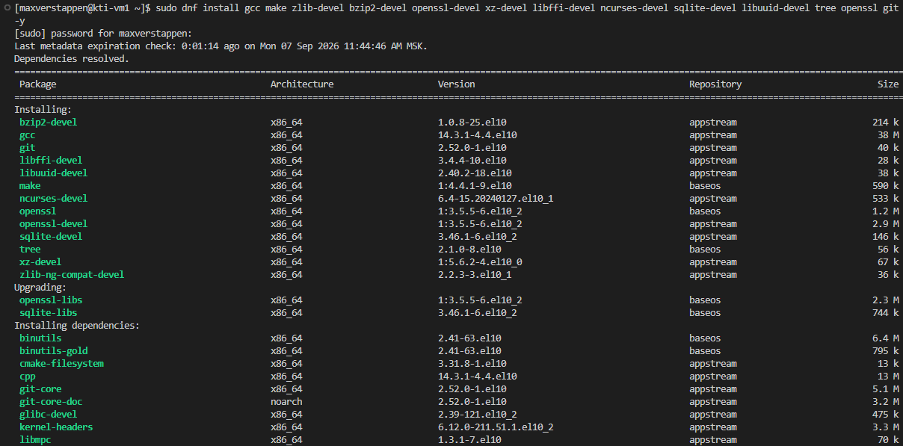

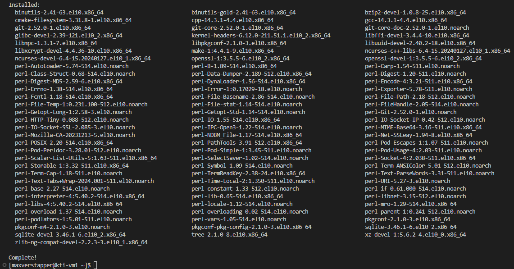

Актуальную версию для сборки удобно и надёжно получить прямо из консоли, не заходя в браузер: запрашиваем у GitHub список тегов репозитория [`python/cpython`](https://github.com/python/cpython/tags), отфильтровываем только финальные релизы (без `rc`/`a`/`b`) и берём максимальный по номеру. Сразу сохраним его в переменную — она понадобится во всех следующих командах:

```bash
PY_VERSION=$(git ls-remote --tags --refs https://github.com/python/cpython.git \
  | awk -F/ '{print $3}' \
  | grep -E '^v[0-9]+\.[0-9]+\.[0-9]+$' \
  | sort -V | tail -1 | sed 's/^v//')
```

```bash
echo "Актуальная версия: $PY_VERSION"
```

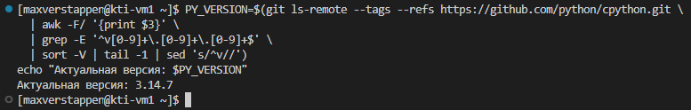

>[!WARNING]
>Переменная `PY_VERSION` — обычная переменная bash, а не переменная окружения. Она живёт только в текущей сессии терминала: если открыть новую вкладку/подключение или перезайти по SSH, её нужно будет вычислить заново.

Исходный код можно получить одним из двух способов — оба в итоге дают одинаковую структуру файлов в директории `cpython`, поэтому дальнейшие команды сборки не зависят от выбранного варианта.

**Вариант 1. Клонировать репозиторий** (ключ `-b` позволяет указать клонируемую ветку/тег):

```bash
git clone -b v"$PY_VERSION" https://github.com/python/cpython.git
```

>[!NOTE]
>При клонировании появляется предупреждение `warning: refs/tags/v... is not a commit!` перед `Note: switching to '<hash>'`. Это ожидаемое поведение для аннотированных тегов cpython — git сначала находит объект тега, затем переключается на коммит, на который тот указывает. Клонирование при этом завершается успешно.

После клонирования появляется директория `cpython`, проверить это можно командой:

```bash
ls cpython/
```

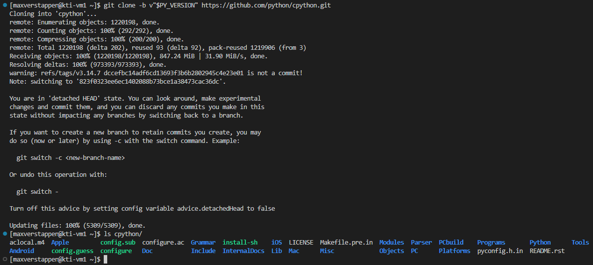

**Вариант 2. Скачать архив с исходным кодом** и распаковать его так, чтобы структура совпадала с той, что даёт клонирование. Архив с python.org по умолчанию распаковывается в папку `Python-X.Y.Z/`, а не `cpython/` — поэтому сначала создадим директорию `cpython`, а затем распакуем архив прямо в неё, срезав лишний верхний уровень флагом `--strip-components=1`:

```bash
curl -O "https://www.python.org/ftp/python/${PY_VERSION}/Python-${PY_VERSION}.tgz"
```

```bash
mkdir -p cpython
```

```bash
tar zxf "Python-${PY_VERSION}.tgz" --strip-components=1 -C cpython/
```

```bash
ls cpython/
```

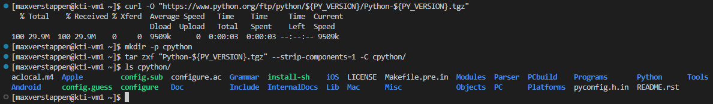

>[!NOTE]
>В отличие от клонирования, архив не содержит директорию `.git/` — это единственное структурное отличие. Если планируется работать с историей репозитория (переключаться между тегами, смотреть `git log` и т.п.), предпочтительнее вариант с клонированием.

В нашем случае для дальнейшей сборки используем результат клонирования — переходим в директорию `cpython`:

```bash
cd cpython
```


Теперь, находясь в папке с исходниками, мы можем сконфигурировать сборку Python и выполнить её. Конфигурация выполняется командой:

```bash
./configure --enable-optimizations
```

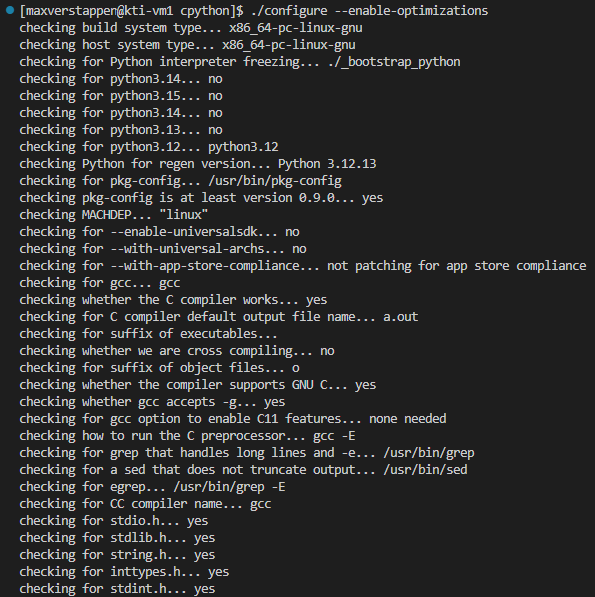

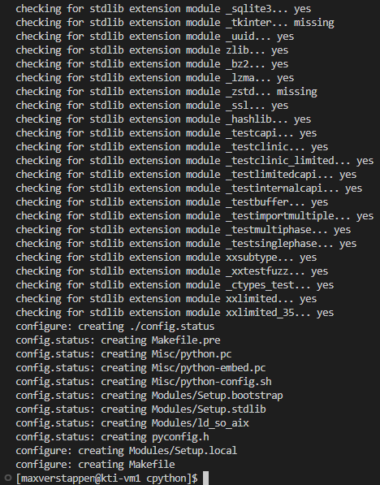

После завершения конфигурации собрать Python можно командой:

```bash
make -s -j$(nproc)
```

>[!NOTE]
>Вместо `-j2` используется `-j$(nproc)` — эта подстановка берёт число доступных процессорных ядер автоматически, поэтому сборка использует все ядра, а не только два, и на многоядерных машинах проходит заметно быстрее.

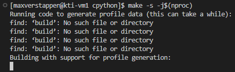

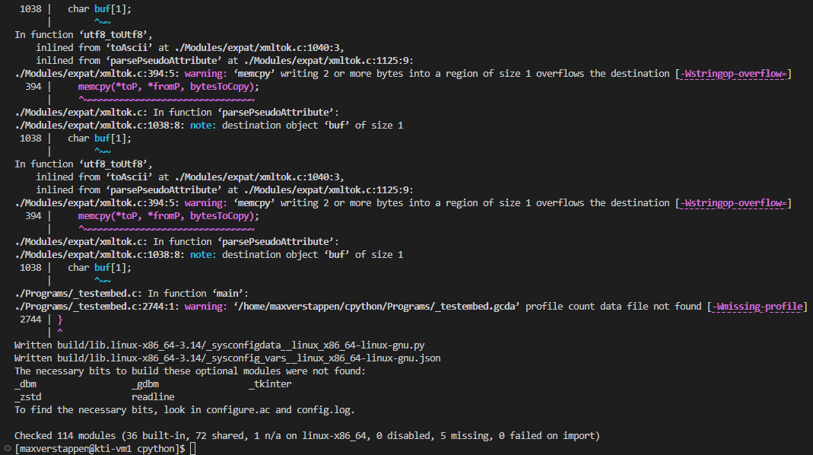

>[!NOTE]
>Если в списке пакетов на шаге установки зависимостей отсутствуют `gdbm-devel`, `tk-devel`, `libzstd-devel`, `readline-devel`, в конце сборки появится предупреждение о нескольких пропущенных опциональных модулях (`_dbm`, `_gdbm`, `_tkinter`, `_zstd`, `readline`). Для этой лабораторной работы (Flask, Gunicorn, SQLite) они не требуются, поэтому предупреждение можно игнорировать.

Сборка Python завершена, в текущей директории находится исполняемый файл. Проверим это:

```bash
ls -ahl python
```

```bash
./python -V
```

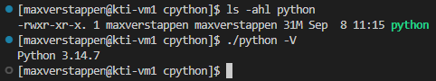

Следующим этапом будет установка Python, для этого понадобится выполнить команду с правами суперпользователя:

```bash
sudo make -s -j$(nproc) install
```

Поставляемый с дистрибутивом операционной системы Python (3.12) установлен в каталог /usr/bin, а собранный нами из исходников Python (в нашем случае 3.14) устанавливается в /usr/local/bin, то есть перезаписи одной версии другой не происходит — обе продолжают существовать независимо и доступны по отдельным командам:

```bash
which python3
```

```bash
which python3.12
```

```bash
which python3.14
```

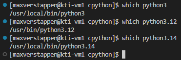

Свежая версия уже доступна по алиасу `python3`, потому что появилась новая символьная ссылка `/usr/local/bin/python3`, которая ведёт к исполняемому файлу собранного Python. Проверить это, а заодно убедиться, что старая версия из репозитория осталась на месте как отдельный файл, можно так:

```bash
ls -ahl /usr/local/bin/python3
```

```bash
ls -ahl /usr/bin/python3.12
```

```bash
ls -ahl /usr/local/bin/python3.14
```

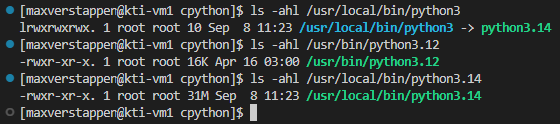

Убедимся также, что обе версии полноценно работают под своими именами:

```bash
python3 -V
```

```bash
python3.12 -V
```

```bash
python3.14 -V
```

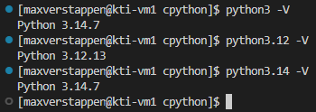

Для установки пакетов Python используется пакетный менеджер pip. Он устанавливается вместе с новой версией Python, и в `/usr/local/bin/` появляется сразу несколько исполняемых файлов — `pip3.14` и `pip3`:

```bash
which pip3
```

```bash
ls -ahl /usr/local/bin/pip3
```

```bash
pip3 -V
```

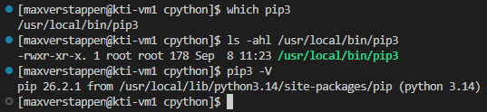

>[!NOTE]
>`pip3` — это самостоятельный исполняемый файл, а не символьная ссылка на `pip3.14`. Оба варианта равнозначны и запускают один и тот же pip; какой из них вызывать — вопрос удобства, а не «главный/дополнительный» файл.

Пример команды для установки пакетов Python:

```bash
pip3 install `package_name`
```

### Запуск простого веб-приложения
>[!NOTE]
>В процессе разработки хорошим тоном считается создавать виртуальное окружение, в которое уже загружать необходимые пакеты. Это легко контролируется, не вредит нашей операционной системе и уберегает от конфликтов версий. 

Создадим виртуальное окружение, но перед этим вернёмся в домашнюю директорию:

```bash
cd
```

Теперь приступим к созданию:

```bash
mkdir -p flask_project
```

```bash
cd flask_project
```

```bash
python3 -m venv .venv
```

Мы создали виртуальное окружение в директории `flask_project`. Теперь активируем его:

```bash
source .venv/bin/activate
```

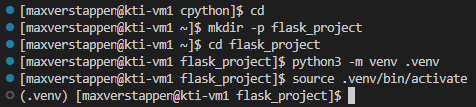

После выполнения команд можно заметить появившуюся директорию `.venv` в папке `flask_project`. Также после активации изменилось приглашение к вводу командной строки, указывающее, что виртуальное окружение активировано.

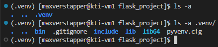

В директории `.venv/bin` находятся символьные ссылки и исполняемые файлы Python и pip той версии, которые были использованы при создании виртуального окружения. Другими словами, в виртуальном окружении Python и pip можно вызывать без указания версии в названии программы.

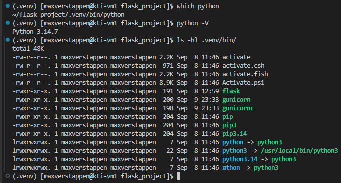

Пакеты можно устанавливать, написав название пакета в репозитории [PyPI](https://pypi.org/) или указав ссылку для загрузки. Установить Flask можно командой:

```bash
pip install flask
```

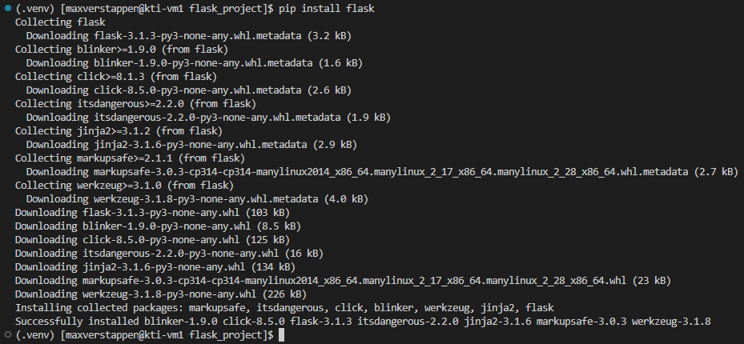

Для проверки работоспособности Flask сделаем простейшее приложение. Создадим в папке `flask_project` директорию `flask_app`, в ней файл `app.py` следующего содержания:

```python
from flask import Flask


app = Flask(__name__)


@app.route("/")
def hello_world():
    return "<p>Hello, World!</p>"
```

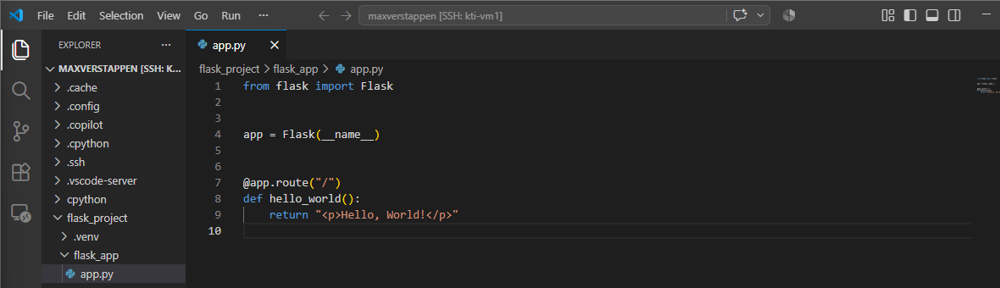

> [!warning]
>*Не забудьте* сохранить изменения в файле с помощью хоткея `Ctrl+S`.

>[!NOTE]
>Разберём написанный код. На первой строке из модуля flask импортируется класс Flask, экземпляром которого будет наше приложение. Далее объявляется экземпляр этого класса с аргументом `__name__`. Затем используется декоратор route, сообщающий Flask, какой URL должен обрабатываться следующей за ним функцией. Функция в свою очередь возвращает HTML, который будет отображён в браузере.


Также для работы с Python в VS Code рекомендуется установить соответствующее расширение (об этом написано [здесь](Preparation_for_labs.md/#установка-vs-code-и-расширений)).

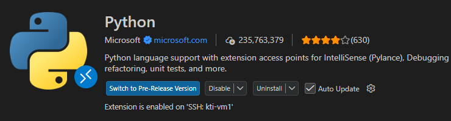

После установки расширения можно выбрать интерпретатор. В случае если интерпретатор был выбран автоматически, может возникнуть предупреждение о том, что невозможен импорт из модуля flask.

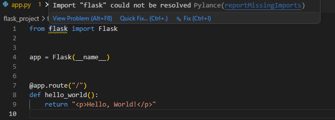

Это связано с тем, что установленное расширение по умолчанию использует системный интерпретатор и ничего не знает о настроенном нами виртуальном окружении. Посмотреть на используемый интерпретатор можно, нажав на версию Python в правом нижнем углу.

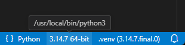

По клику откроется список найденных интерпретаторов — если в нём нет варианта из нашего виртуального окружения, следует его добавить, выбрав пункт **Enter interpreter path...**:

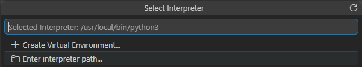

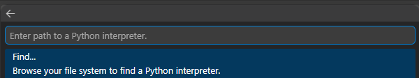

Путь к интерпретатору виртуального окружения можно узнать из вывода команды `which python` (вывод команды — `~/flask_project/.venv/bin/python`):

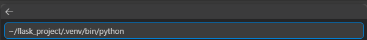

После применения расширение обновит используемый интерпретатор, и ошибка `Import "flask" could not be resolved` исчезнет:

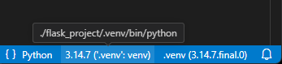

Теперь запустим наше приложение. Находясь в папке `flask_app`, пропишем:

```bash
flask run
```

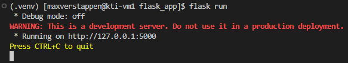

Сообщение `Running on http://127.0.0.1:5000` говорит о том, что приложение запущено и доступно по порту 5000. VS Code заботливо пробросит порт в сетевое окружение хоста, так что URL доступен в браузере:


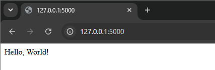

По умолчанию Flask запускается и прослушивает только адрес локального сетевого адаптера (localhost). Чтобы получать запросы с других адаптеров, необходимо передать адрес этого сетевого интерфейса при запуске или разрешить принимать подключения со всех сетевых адаптеров. За такое поведение отвечает опция `--host`:

```bash
flask run --host=0.0.0.0
```

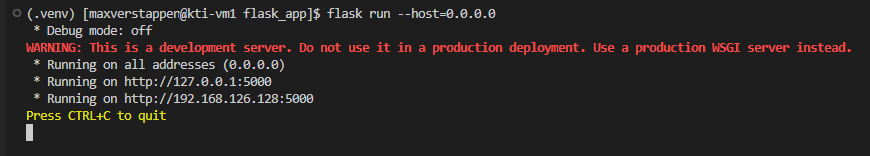

В отличие от прошлого запуска в выводе добавилась строка `Running on http://192.168.126.128:5000`. Однако, если попытаться открыть этот URL, увидим ошибку:

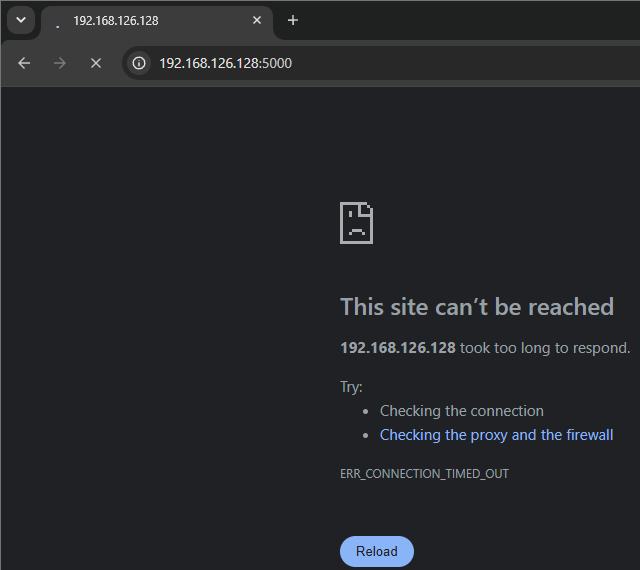

Несмотря на то, что порт прослушивается и приложение ожидает подключение по IP-адресу интерфейса виртуальной машины, клиентские запросы из браузера не могут достичь сервера. Всё дело в настройках файрволла. Посмотреть список правил можно командой:

```bash
sudo firewall-cmd --list-all
```

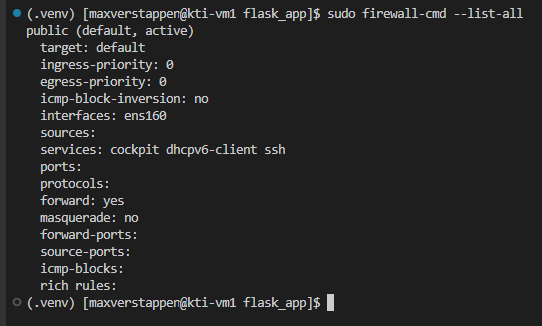

Чтобы исправить ситуацию, необходимо открыть порт 5000 в настройках файрволла:

```bash
sudo firewall-cmd --add-port=5000/tcp
```

Вторая команда нужна для сохранения введённых настроек.

```bash
sudo firewall-cmd --runtime-to-permanent
```

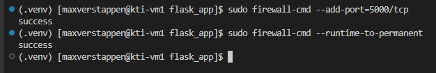

После этого повторно запустим приложение:

```bash
flask run --host=0.0.0.0
```

В логе сервера сразу видны успешные запросы от клиента с адресом `192.168.126.1` — это хостовая машина, обратившаяся к серверу приложений на этот раз именно по IP-адресу интерфейса виртуальной машины, а не через проброшенный VS Code порт:

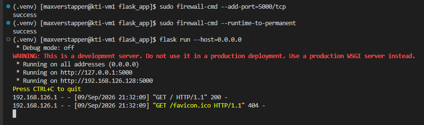

Результат виден и в браузере:

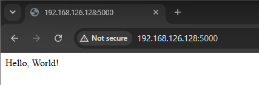

Этого достаточно для локальной разработки, однако в промышленных контурах пользовательские запросы не приходят сразу на сервер приложений, перед этим они проходят через серверы балансировки и распределения нагрузки.

---

## NGINX
### Установка веб-сервера NGINX
>[!NOTE]
>В данной работе веб-сервер NGINX будет использован как обратный прокси-сервер, принимающий запросы пользователя и перенаправляющий их на бэкенд – Flask-приложение.

>[!NOTE]
>Как и подавляющее большинство программного обеспечения, установить веб-сервер NGINX на Rocky Linux можно при помощи пакетного менеджера. Для этого добавим репозиторий разработчика.

Прежде всего следует обратиться на сайт разработчика ([рабочая ссылка](https://nginx.org/ru/linux_packages.html#RHEL) на момент написания данного руководства). Воспользуемся предложенным вариантом установки. Создадим новый файл репозитория с помощью **ЛУЧШЕГО** текстового редактора **vi** командой:

```bash
sudo vi /etc/yum.repos.d/nginx.repo
```

Текст можно набрать вручную или скопировать со страницы сайта. В любом случае прежде чем добавлять контент, необходимо перейти в режим редактирования, нажав `i` (после этого режим поменяется на INSERT, о чем говорит появившаяся снизу надпись).


Чтобы сохранить файл, можно посмтупить по-разному:
- нажать комбинацию клавиш `Shift+ZZ`;
- клавишу `Esc`, после чего написать `:wq`.

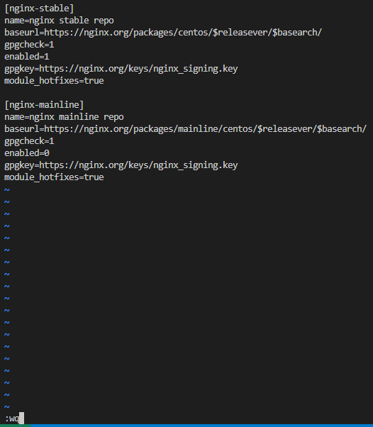

Проверим, сохранились ли изменения в файле:

```bash
cat /etc/yum.repos.d/nginx.repo
```

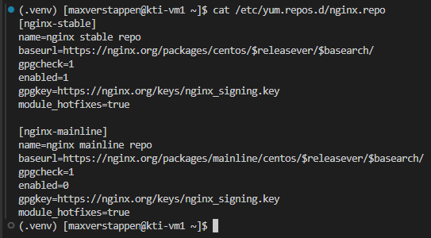

Теперь, после проверки содержимого файла, посмотрим, какую версию и из какого репозитория будет устанавливать пакетный менеджер.

```bash
dnf info nginx
```

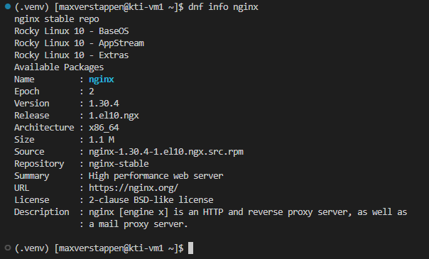

Теперь установим NGINX при помощи команды:

```bash
sudo dnf install nginx -y
```

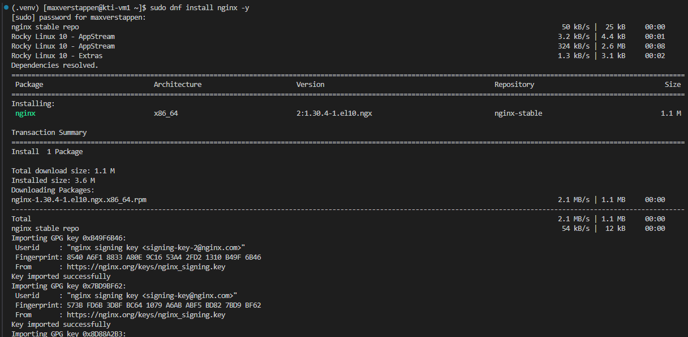

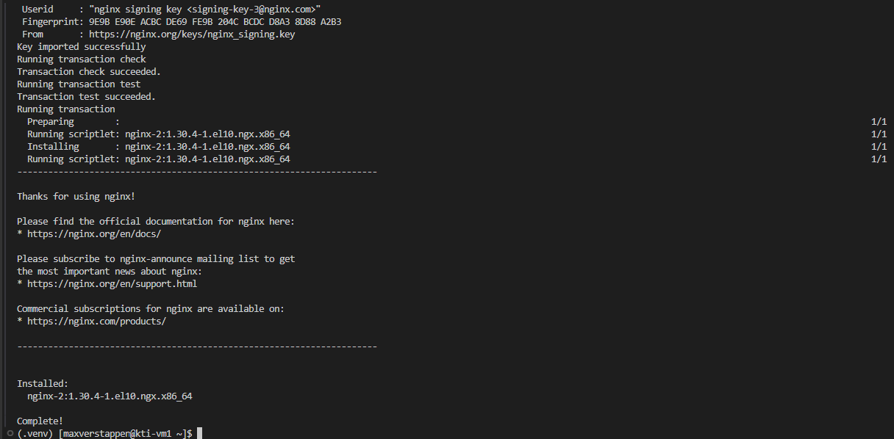

Веб-сервер можно запустить как службу (процесс в фоне). Для этого можно воспользоваться командой `systemctl`, позволяющей управлять процессами в Linux. Несколько полезных вариантов применения этой команды:

| Команда                        | Описание                                  |
|--------------------------------|-------------------------------------------|
| `systemctl start nginx`        | запустить сервис                          |
| `systemctl stop nginx`         | остановить сервис                         |
| `systemctl restart nginx`      | перезапуск сервиса                        |
| `systemctl enable nginx`       | добавить сервис в автозагрузку            |
| `systemctl enable --now nginx` | добавить в автозагрузку и сразу запустить |
| `systemctl status nginx`       | показать состояние сервиса                |

Воспользуемся командой:

```bash
sudo systemctl enable --now nginx
```

Проверим, что веб-сервер успешно стартовал и готов принимать HTTP-запросы:

```bash
systemctl status nginx
```

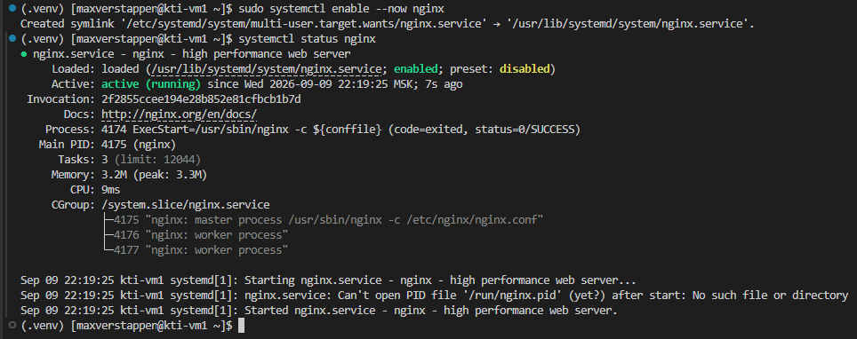

Откроем в браузере страницу по IP-адресу нашей ВМ. NGINX запущен, однако доступа к сайту нет.


Мы уже сталкивались с подобной ситуацией, необходимо добавить в настройки файрволла еще несколько разрешающих правил. В настройках файрволла по умолчанию нет разрешающих правил для протоколов **HTTP** и **HTTPS**, которые используются браузером при обращении к веб-серверу. Исправить это можно командами:

```bash
sudo firewall-cmd --add-service=http
```

```bash
sudo firewall-cmd --add-service=https
```

```bash
sudo firewall-cmd --runtime-to-permanent
```

После чего можно проверить конфигурацию файрволла.

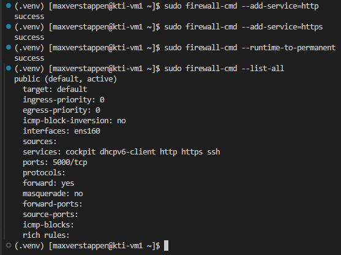

Если все настроено правильно, то в браузере по IP-адресу нашей виртуальной машины откроется стартовая страница NGINX.

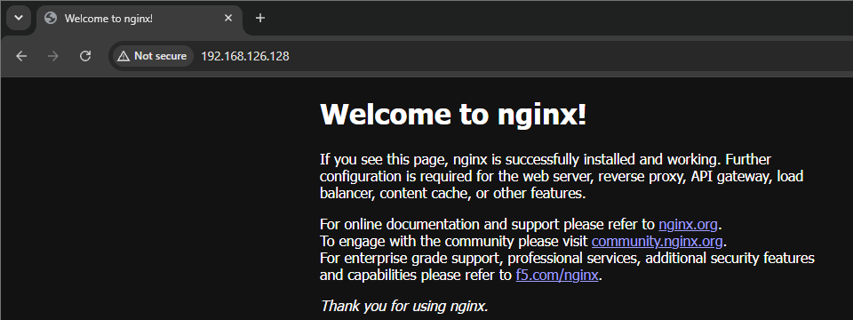

Сработало.

---

### Управление конфигурацией веб-сервера NGINX
>[!NOTE]
>Файл конфигурации NGINX по умолчанию находится в каталоге `/etc/nginx` и называется `nginx.conf`:
>
>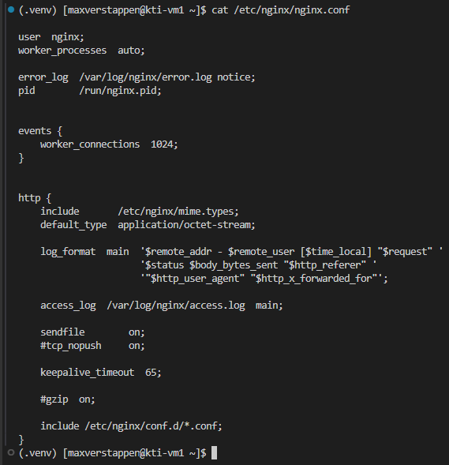
>
>Содержимое конфигурационного файла `nginx.conf` по умолчанию различается в зависимости от версии, далее приведено актуальное на момент написания руководства:
>
>```nginx
>user  nginx;
>worker_processes  auto;
>
>error_log  /var/log/nginx/error.log notice;
>pid        /run/nginx.pid;
>
>
>events {
>    worker_connections  1024;
>}
>
>
>http {
>    include       /etc/nginx/mime.types;
>    default_type  application/octet-stream;
>
>    log_format  main  '$remote_addr - $remote_user [$time_local] "$request" '
>                      '$status $body_bytes_sent "$http_referer" '
>                      '"$http_user_agent" "$http_x_forwarded_for"';
>
>    access_log  /var/log/nginx/access.log  main;
>
>    sendfile        on;
>    #tcp_nopush     on;
>
>    keepalive_timeout  65;
>
>    #gzip  on;
>
>    include /etc/nginx/conf.d/*.conf;
>}
>```
>
>В [официальном руководстве](https://nginx.org/ru/docs/beginners_guide.html#conf_structure) описана структура конфигурационного файла, иерархически состоящая из модулей и директив. Внешние файлы можно подключить директивой `include`, например, `include /etc/nginx/conf.d/*.conf` позволяет включать в конфигурацию все файлы из папки `/etc/nginx/conf.d/`, оканчивающиеся на `.conf`. Таким образом, для каждого сайта можно создать отдельный конфигурационный файл, что считается хорошим тоном. По умолчанию в этой директории находится файл `default.conf` следующего содержания:
>
>```nginx
>server {
>    listen       80;
>    server_name  localhost;
>
>    #access_log  /var/log/nginx/host.access.log  main;
>
>    location / {
>        root   /usr/share/nginx/html;
>        index  index.html index.htm;
>    }
>
>    #error_page  404              /404.html;
>
>    # redirect server error pages to the static page /50x.html
>    #
>    error_page   500 502 503 504  /50x.html;
>    location = /50x.html {
>        root   /usr/share/nginx/html;
>    }
>
>    # proxy the PHP scripts to Apache listening on 127.0.0.1:80
>    #
>    #location ~ \.php$ {
>    #    proxy_pass   http://127.0.0.1;
>    #}
>
>    # pass the PHP scripts to FastCGI server listening on 127.0.0.1:9000
>    #
>    #location ~ \.php$ {
>    #    root           html;
>    #    fastcgi_pass   127.0.0.1:9000;
>    #    fastcgi_index  index.php;
>    #    fastcgi_param  SCRIPT_FILENAME  /scripts$fastcgi_script_name;
>    #    include        fastcgi_params;
>    #}
>
>    # deny access to .htaccess files, if Apache's document root
>    # concurs with nginx's one
>    #
>    #location ~ /\.ht {
>    #    deny  all;
>    #}
>}
>```
>
>Директива `server` задаёт виртуальный сервер, который прослушивает порт 80 (`listen 80`), что соответствует протоколу **HTTP**, этот сервер будет обрабатывать запросы по доменному имени localhost (`server_name localhost`).
>
>Директива `location` указывает, где в файловой системе расположены html или другие файлы, содержимое которых следует обработать по запросу определённых URL. В рассматриваемом файле URL представляет собой корень сайта – на это указывает символ `/`. Таким образом, при запросе странички сайта `http://localhost` веб-сервер будет искать файлы для обработки в директории `/usr/share/nginx/html`, на что указывает директива `root`. Директива `index` указывает, какие файлы следует обработать в случае, если имя файла не задано в URL.
>
>Если заглянуть в директорию `/usr/share/nginx/html`, то там можно обнаружить файл `index.html`, его содержимое является страничкой приветствия NGINX:
>
>```html
><!DOCTYPE html>
><html>
><head>
><title>Welcome to nginx!</title>
><style>
>html { color-scheme: light dark; }
>body { width: 35em; margin: 0 auto;
>font-family: Tahoma, Verdana, Arial, sans-serif; }
></style>
></head>
><body>
><h1>Welcome to nginx!</h1>
><p>If you see this page, nginx is successfully installed and working.
>Further configuration is required for the web server, reverse proxy, 
>API gateway, load balancer, content cache, or other features.</p>
>
><p>For online documentation and support please refer to
><a href="https://nginx.org/">nginx.org</a>.<br/>
>To engage with the community please visit
><a href="https://community.nginx.org/">community.nginx.org</a>.<br/>
>For enterprise grade support, professional services, additional 
>security features and capabilities please refer to
><a href="https://f5.com/nginx">f5.com/nginx</a>.</p>
>
><p><em>Thank you for using nginx.</em></p>
></body>
></html>
>```

При желании развернуть собственный веб-сайт следует создать новый виртуальный сервер при помощи директивы `server`, в `location` которого указать путь к папке с html-файлами.

NGINX зачастую используют как обратный прокси (запрос от пользователя принимается NGINX и перенаправляется к приложению). Напишем для этого отдельный конфигурационный файл, а дефолтный сохраним c расширением `.bkp`, чтобы конфиг из него не считывался.

У каталога `/etc/nginx` владелец – пользователь root, а у обычного пользователя по умолчанию нет прав изменять в нем файлы. Проверим это:

```bash
ls -hl /etc/nginx/
```

```bash
ls -hl /etc/nginx/conf.d/
```

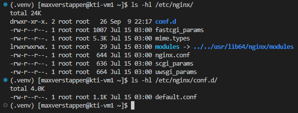

Так сделано в целях безопасности. В рамках данной работы изменим права на директорию `/etc/nginx/conf.d`, в которой создадим свой конфигурационный файл. Простейшим способом получить права является использование команды `chmod`:

```bash
sudo chmod o+w /etc/nginx/conf.d/
```

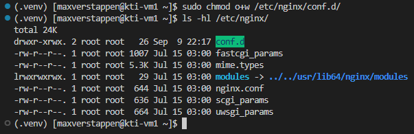

Перейдём в директорию `conf.d` и переименуем файл:

```bash
mv ./default.conf ./default.conf.bkp
```

Проверить новое название можно командой `ls`.

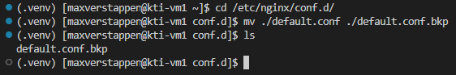

В папке `conf.d` создадим файл `flask_app.conf` следующего содержания:

```nginx
server {
    listen 80;
    server_name _;

    location / {
        proxy_pass http://localhost:5000;
    }
}
```

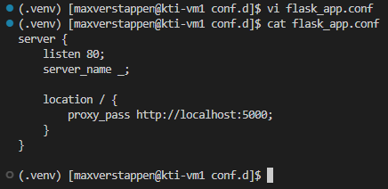

>[!NOTE]
>Директива `proxy_pass` указывает на то, что все запросы, полученные по URL данного `location` (в данном случае `/` – это корень сайта) необходимо проксировать на `http://localhost:5000`.

NGINX позволяет проверить синтаксис конфигурации командой:

```bash
sudo nginx -t
```

После следующей команды NGINX перечитает конфиг:

```bash
sudo nginx -s reload
```

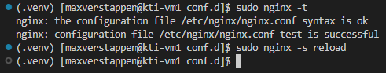

Теперь NGINX будет перенаправлять все пришедшие запросы на наше приложение и отдавать пользователю ответ от него.

Запустим наше приложение и попробуем открыть его в браузере по IP-адресу ВМ.

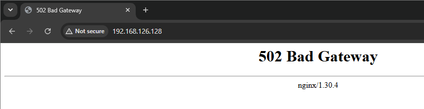

Пу-пу-пу… Причиной ошибки 502 может быть отсутствие запущенного приложения на 5000-м порту.

В правом углу терминала откроем новую консоль, чтобы не останавливать наше приложение, запущенное в первой консоли. Сделать это можно несколькими способами: нажать на стрелку рядом с иконкой `+` в панели терминала и выбрать **New Terminal** (или **Split Terminal**, чтобы открыть консоль рядом с текущей, разделив панель):


либо через меню **⋯** в правом верхнем углу окна → **Terminal**, где помимо тех же пунктов есть ещё и **New Terminal Window**, открывающий терминал в отдельном окне:


И в новой консоли введём команду, которая поможет нам проверить, прослушивается ли порт 5000:

```bash
ss -tpln | grep 5000
```


> [!warning]
> Если результат пустой - значит flask-приложение не запущено

На удивление всё в порядке, тогда пролить свет истины на возникшую ситуацию может помочь чтение логов NGINX, например так:

```bash
sudo tail -f /var/log/nginx/error.log
```


В логах видны строчки: `2026/09/09 22:45:49 [crit] 4949#4949: *5 connect() to 127.0.0.1:5000 failed (13: Permission denied) while connecting to upstream, client: 192.168.126.1, server: _, request: "GET / HTTP/1.1", upstream: "http://127.0.0.1:5000/", host: "192.168.126.128"`. Судя по этим записям, подключение к бэкенду `127.0.0.1:5000` не удалось, потому что запрещён доступ. В данном случае эта ситуация вызвана работой **SELinux** (Security-Enhanced Linux), он блокирует подключение NGINX к Flask-приложению. Проверить, включен ли SELinux, можно командой:

```bash
getenforce
```

А выключить до следующей перезагрузки можно так:

```bash
sudo setenforce 0
```


Попробуем снова подключиться.


После перевода SELinux в режим `Permissive` сайт открывается, значит дело именно в механизме безопасности. Отключение SELinux не самое безопасное решение и не является [примером хороших практик](https://stopdisablingselinux.com), гораздо грамотнее написать правила, разрешающие конкретные операции. В нашем случае, чтобы разрешить трафик от NGINX, можно добавить правило:

```bash
sudo setsebool -P httpd_can_network_connect 1
```

И снова включить SELinux.

```bash
sudo setenforce 1
```


После выполнения всех указанных операций была получена работоспособная и в некоторой степени безопасная конфигурация.

---

## Установка и запуск WSGI-сервера
При запуске Flask возникает предупреждение: `WARNING: This is a development server. Do not use it in a production deployment. Use a production WSGI server instead.`

Займёмся установкой и настройкой WSGI-сервера. Он позволяет автоматизировать запуск и удобно масштабировать веб-приложения. В данной работе применяется WSGI-сервер Gunicorn. Установим Gunicorn в виртуальное окружение командой:

```bash
pip install gunicorn
```


После установки нужно убедиться, что Gunicorn может правильно обслуживать приложение. Для запуска gunicorn'у необходимо передать название модуля и имя переменной с приложением в формате `$(MODULE_NAME):$(VARIABLE_NAME)`. Имя модуля в нашем случае – название файла `app.py` без расширения, а имя переменной является именем вызываемого объекта в этом модуле, в данной ситуации – `app`. В результате команда запуска примет вид:

```bash
gunicorn app:app
```


Судя по выводу, приложение прослушивает сокет `127.0.0.1:8000`. В целях отладки откроем порт 8000 и укажем другой сокет так, чтобы можно было получить ответ в браузере на хосте:

```bash
sudo firewall-cmd --add-port=8000/tcp
```

```bash
sudo firewall-cmd --runtime-to-permanent
```

```bash
gunicorn -b 0.0.0.0 app:app
```


Откроем страницу в браузере.


Одной из возможностей Gunicorn является запуск нескольких рабочих процессов – worker. Изменим код нашего приложения `app.py` так, чтобы в ответ оно отдавало строку с Process ID:

```python
from flask import Flask
import os


app = Flask(__name__)


@app.route("/")
def hello_world():
    pid = os.getpid()
    return f"Process ID: {pid}"


if __name__ == '__main__':
    app.run()
```


>[!NOTE]
>Условие `if __name__ == "__main__"` выполняется в случае, если файл вызван на исполнение напрямую (например, командой `python app.py`), а не импортирован из другого файла. Таким образом, можно запускать приложение напрямую для отладки, а целевой схемой останется запуск посредством Gunicorn.

Выполним запуск командой с указанием количества worker-процессов:

```bash
gunicorn -w 3 -b 0.0.0.0 app:app
```


В выводе видны номера запущенных процессов. Проверим, что странички открываются с разными номерами:


Один из важных выводов из проделанного – несколько worker-процессов (несколько экземпляров одного и того же бэкенда, работающих параллельно) могут принимать запросы через один и тот же сокет, распределяя нагрузку между собой.

Займёмся автоматизацией запуска нашего приложения. В Linux существует множество вариантов настроить автозапуск, в данной работе рассматривается вариант с использованием Systemd. Systemd - это набор базовых компонентов Linux, обладающий обширным функционалом, в том числе предлагающий развитую логику управления службами. Мы уже работали с Systemd, запуская и перезапуская NGINX командой `systemctl`. Службы в Systemd описываются в так называемых unit-файлах. Создадим такой файл для запуска Gunicorn.

```bash
mkdir -p ~/.config/systemd/user/
```

```bash
vi ~/.config/systemd/user/flask_app.service
```

Внутри напишем:

```conf
[Unit]
Description=Gunicorn instance to serve flask_app
Requires=flask_app.socket
After=network.target

[Service]
Type=notify
WorkingDirectory=%h/flask_project/flask_app
Environment="PATH=%h/flask_project/.venv/bin"
ExecStart=gunicorn \
          --access-logfile - \
          app:app

[Install]
WantedBy=multi-user.target
```

Проверим содержимое файла:

```bash
cat ~/.config/systemd/user/flask_app.service
```


Создадим unit-файл с описанием сетевого сокета, через который будет идти обмен сообщений между NGINX и нашим приложением:

```bash
vi ~/.config/systemd/user/flask_app.socket
```

```conf
[Unit]
Description=gunicorn socket

[Socket]
ListenStream=127.0.0.1:8000

[Install]
WantedBy=sockets.target
```

Проверим содержимое файла:

```bash
cat ~/.config/systemd/user/flask_app.socket
```


Внесём в конфиг NGINX (`flask_app.conf`) следующие изменения:

```bash
vi /etc/nginx/conf.d/flask_app.conf
```

```nginx
upstream flask_app {
    server 127.0.0.1:8000;
}

server {
    listen 80;
    server_name _;

    location / {
        proxy_set_header X-Forwarded-For $proxy_add_x_forwarded_for;
        proxy_set_header X-Forwarded-Proto $scheme;
        proxy_set_header Host $http_host;
        proxy_redirect off;
        # proxy_pass http://127.0.0.1:5000;
        proxy_pass http://flask_app;
    }
}
```

Проверим синтаксис и применим изменения:

```bash
sudo nginx -t
```

```bash
sudo nginx -s reload
```


В итоге должна получиться такая картина:


Осталось включить сокет нашего приложения:

```bash
systemctl --user enable --now flask_app.socket
```

Проверим состояние нашего сокета и запускаемой им службы.

```bash
systemctl --user status flask_app.socket
```

```bash
systemctl --user status flask_app.service
```


>[!NOTE]
>Служба `flask_app.service` находится в состоянии `inactive (dead)` — это ожидаемое поведение. При активации через сокет Gunicorn запускается автоматически только при поступлении первого запроса (что и отражено в `Triggers`/`TriggeredBy`), а до этого момента ресурсы не расходуются.

Убедимся в этом на практике — отправим запрос и снова проверим состояние службы:

```bash
curl http://127.0.0.1
```

```bash
systemctl --user status flask_app.service
```


Служба перешла в состояние `active (running)` сразу после первого запроса, а в CGroup видны запущенные процессы Gunicorn.

>[!NOTE]
>`flask_app.socket` и `flask_app.service` — **пользовательские** юниты (`systemctl --user`). По умолчанию менеджер пользовательских юнитов запускается только при входе пользователя в сессию (например, по SSH) и останавливается вместе с последней сессией — то есть не будут работать, пока никто не залогинится. Чтобы менеджер пользовательских юнитов запускался вместе с системой независимо от входа в сессию, нужно включить linger для нашего пользователя.

```bash
sudo loginctl enable-linger $USER
```

Проверить, что linger включен, можно командой:

```bash
loginctl show-user $USER --property=Linger
```


Команда должна вывести `Linger=yes`.

Если все выполнено верно и linger включён, то NGINX (как системная служба) и пользовательский сокет `flask_app.socket` автоматически запустятся после загрузки операционной системы, даже без входа пользователя в сессию. А значит, после перезагрузки виртуальной машины наше приложение начнёт работать и будет доступно по порту 80. После старта сокета можно произвести проверку в браузере.

---

## Использование СУБД для хранения информации
>[!NOTE]
>Для хранения информации пользователей в приложениях обычно используются базы данных, которые управляются **системами управления базами данных** (СУБД). В качестве примера таких систем можно привести MySQL, PostgreSQL, etcd, MongoDB, SQLite. СУБД обычно разворачивают на отдельном высокопроизводительном сервере, однако для небольших проектов или в среде тестирования и разработки допускается развёртывание локальных инстансов.

Мы запустим СУБД локально, воспользовавшись решением SQLite. Развернём проект, содержащий страницы регистрации, входа и выхода с сохранением пользовательских данных в базе данных.

Для начала, находясь в папке `flask_project`, введём команду:

```bash
rm -rf flask_app/
```

После чего клонируем проект из репозитория:

```bash
git clone https://github.com/kottik-mypp/flask_app.git
```


Перейдём в директорию `flask_app`, где в файле `requirements.txt`  описаны необходимые для запуска приложения модули и пакеты. Установить их можно, воспользовавшись этим файлом с помощью команды:

```bash
pip install -r requirements.txt
```


Просмотреть список установленных модулей можно командой:

```bash
pip list
```


Перезапустим и сокет приложения.

```bash
systemctl --user restart flask_app.socket
```

Теперь приложение должно быть доступно в браузере!


**ГИП-ГИП УРА!!!**

При запуске приложения в директории `instance` был создан файл СУБД. К ней можно подключиться локально и посмотреть содержимое таблиц:

```bash
sqlite3 instance/project.db
```

```sql
select * from users;
```


В результате на развернутой виртуальной машине из исходного кода собран интерпретатор Python, установлены необходимые пакеты для запуска приложения с функцией аутентификации, настроено проксирование запросов пользователей через веб-сервер NGINX, создан сервис для автозапуска каждого из компонентов.

**You are amazing! ✨**
