# Выпуск TLS-сертификатов и работа с Git-репозиториями
1. [Настройка TLS](#настройка-tls)
	1. [Создание сертификатов](#создание-сертификатов)
	2. [Настройка веб-сервера и хоста](#настройка-веб-сервера-и-хоста)
2. [Работа с Git](#работа-с-git)
	1. [Основы Git](#основы-git)
	2. [Принципы использования веток](#принципы-использования-веток)
	3. [Использование GitHub](#использование-github)

---

##### Цель работы:
> Получить навыки по выпуску сертификатов, работе с Git-репозиториями.

---

## Настройка TLS
### Создание сертификатов
>[!NOTE]
>Прежде чем браться за настройку TLS, следует разобраться с таким понятием как **PKI**. PKI (Public Key Infrastructure) – инфраструктура открытых ключей, имеет множество вариантов применения, но в основном это шифрование и подпись данных. PKI основана на асимметричном шифровании (это когда для шифрования данных используется один ключ, а для расшифрования - другой). В большинстве случаев данные шифруются закрытым ключом, который хранится в секрете и не распространяется (private key), а расшифровываются на принимающей стороне заранее полученным открытым ключом (public key).
>
>Открытый ключ распространяется не сам по себе, а в составе сертификата (сертификата x.509). Это что-то вроде паспорта, он содержит информацию, позволяющую идентифицировать субъект, которому выдан сертификат (поле `Subject`), указывает, кем он был выпущен (поле `Issuer`), серийный номер сертификата и многое другое. Сертификат можно сгенерировать и подписать самостоятельно (такой сертификат будет называться самоподписанным), а можно приобрести в удостоверяющем центре (УЦ) – организации, специализирующейся на изготовлении сертификатов и электронных цифровых подписей. В первом случае преимуществом будет высокая скорость изготовления, низкие затраты, во втором – сертификат будет приниматься не только на нашем оборудовании, но и у других пользователей.

В данной работе поступим следующим образом – создадим свой локальный УЦ, выпустим его корневой сертификат, который добавим в хранилище доверенных корневых сертификатов на хосте. Это позволит принимать дочерние сертификаты, подписанные нашим УЦ. После чего создадим запрос на сертификат веб-сервера и подпишем его закрытым ключом нашего УЦ. Таким образом получим сертификат с открытым ключом веб-сервера, который будет использовать NGINX при HTTPS-соединении.

Для наглядности и во избежание ошибок каждый файл (ключ, запрос на сертификат и сам сертификат) будем генерировать отдельной командой, используя конфигурационные файлы по мере необходимости. Начнём с закрытого ключа удостоверяющего центра. Но сначала организуем место хранения наших ещё не созданных сертификатов.

```bash
mkdir -p ./pki/{certs,newcerts,private}
```

```bash
cd pki
```

Созданную структуру можно посмотреть, используя команду:

```bash
tree
```

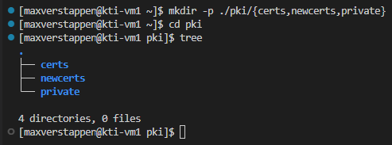

Теперь можем сгенерировать сам ключ.

```bash
openssl genrsa -out ./private/ca.key 4096
```

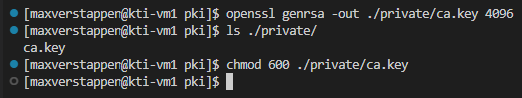

Мы получили файл с именем `ca.key`, в котором содержится закрытый ключ нашего УЦ, сгенерированный по алгоритму **RSA** с длиной ключа 4096 бит.

Закрытый ключ — самая чувствительная часть всей конструкции: тот, кто им завладеет, сможет выпускать сертификаты от имени нашего УЦ. Поэтому сразу закроем к нему доступ всем, кроме владельца:

```bash
chmod 600 ./private/ca.key
```

>[!WARNING]
>Права на закрытые ключи — не формальность. `openssl` не станет ругаться на файл с правами `644`, но такой ключ доступен на чтение любому пользователю системы. Возьмите за правило выставлять `600` сразу после генерации.

Следующим шагом напишем конфигурационный файл `ca_req.cnf` для создания на его основе запроса на сертификат.

```bash
vi ca_req.cnf
```

Он будет следующего содержания:

>[!WARNING]
>Здесь и далее любое упоминание `Max Verstappen`, `IU4-XX` надо заменять на свои инициалы и номер группы *на английском*, в таком формате соответственно: `Ivan Petrov`, `IU4-12`. Также меняйте на свои IP-адреса, доменные имена и хэши коммитов — все они у вас будут отличаться от приведённых в примерах.

```conf
[ req ]
default_bits = 4096
encrypt_key = no
default_md = sha256
prompt = no
utf8 = yes
distinguished_name = ca_distinguished_name

[ ca_distinguished_name ]
C = RU
ST = Moscow State
L = Moscow
O = BMSTU
OU = IU4-XX
CN = Max Verstappen
```

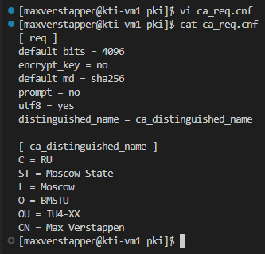

После чего выполним команду для создания запроса на сертификат:

```bash
openssl req -new -key private/ca.key -out certs/ca.csr -config ca_req.cnf
```

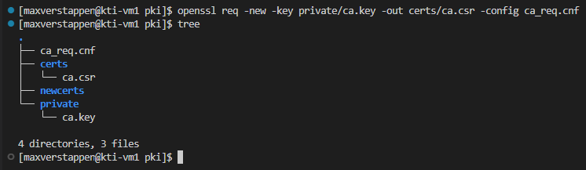

Если для просмотра файла запроса на сертификат использовать `cat`, обнаружится, что информация хранится в кодировке **base64**.

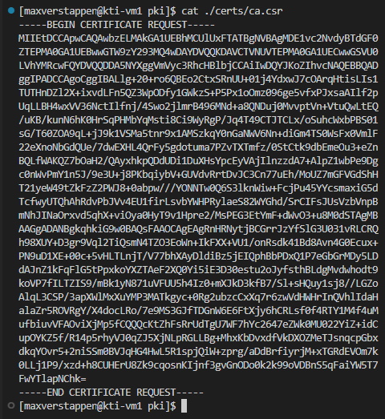

Однако есть возможность увидеть поля запроса и их значения, например, командой:

```bash
openssl req -in certs/ca.csr -noout -text
```

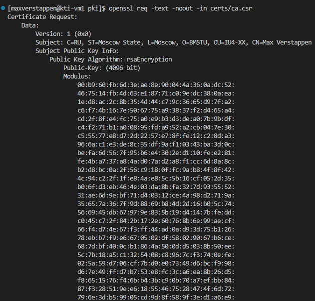

Теперь можно заметить, что поля `Subject` совпадают со значениями этих полей в конфигурационном файле. Ещё одно важное поле — `Modulus` — содержит открытый ключ.

Создадим ещё один конфигурационный файл с именем `ca.cnf`, он будет описывать параметры работы нашего удостоверяющего центра.

```bash
vi ca.cnf
```

```conf
[ ca ]
default_ca = lab3_ca

[ lab3_ca ]
# Путь к каталогу CA
dir               = .
certs             = $dir/certs
new_certs_dir     = $dir/newcerts
database          = $dir/index.txt
serial            = $dir/serial
RANDFILE          = $dir/private/.rand

# Путь к файлам ключей и сертификатов CA
private_key       = $dir/private/ca.key
certificate       = $dir/certs/ca.crt

# Настройки выдачи сертификатов
copy_extensions   = copy
default_days      = 375
default_md        = sha256
preserve          = no
policy            = ca_policy

[ ca_policy ]
countryName = match
stateOrProvinceName = supplied
organizationName = supplied
organizationalUnitName = optional
commonName = supplied

[ v3_ca ]
subjectKeyIdentifier = hash
authorityKeyIdentifier = keyid:always,issuer
basicConstraints = critical, CA:true
keyUsage = critical, digitalSignature, cRLSign, keyCertSign

[ server_cert ]
basicConstraints = CA:FALSE
subjectKeyIdentifier = hash
authorityKeyIdentifier = keyid,issuer
keyUsage = critical, digitalSignature, keyEncipherment
extendedKeyUsage = serverAuth
```

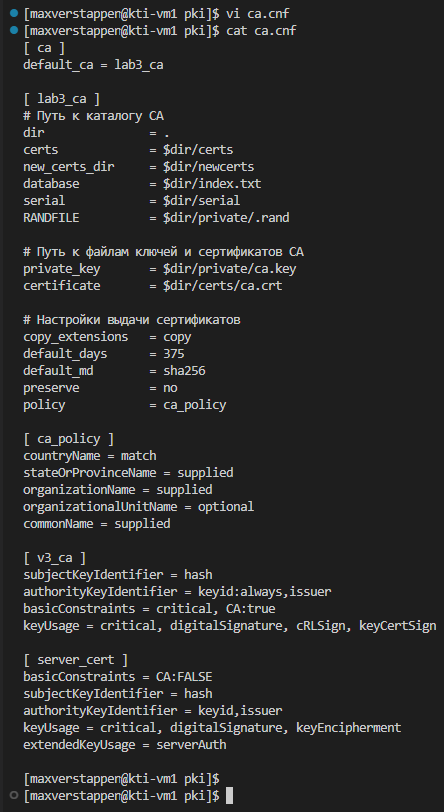

>[!NOTE]
>Секция `[ ca_policy ]` задаёт правила, которым должен удовлетворять входящий запрос на сертификат. `match` означает, что значение поля обязано совпадать с одноимённым полем сертификата самого УЦ, `supplied` — что поле обязано присутствовать в запросе (значение любое), `optional` — что поле можно не указывать. Из-за `countryName = match` все выпускаемые нами сертификаты обязаны иметь `C = RU`: если в запросе будет другая страна, `openssl ca` откажется его подписывать.

Ещё для корректной работы удостоверяющего центра потребуется создать файл с базой данных выпускаемых сертификатов:

```bash
touch index.txt
```

И случайный серийный номер:

```bash
openssl rand -hex 16 > serial
```

И проверим структуру `pki`:

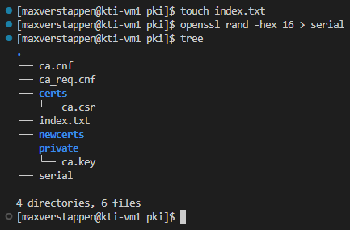

Выполним команду для генерации самоподписанного сертификата УЦ:

```bash
openssl ca -selfsign -days 3650 \
    -in certs/ca.csr -out certs/ca.crt \
    -config ca.cnf -extensions v3_ca
```

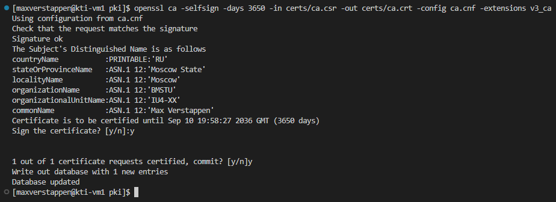

Результатом выполнения команды является сертификат удостоверяющего центра — файл `certs/ca.crt`.

Для просмотра полей сертификата служит команда `openssl x509`. Ей нужно передать путь к файлу (`-in`) и ключ `-noout`, который подавляет вывод самого сертификата в кодировке base64 — без него команда допишет исходный PEM-блок под запрошенными полями. Дальше указывается один или несколько ключей, определяющих, что именно вывести:

| Опция | Что выводит |
|---|---|
| `-subject` | поле `Subject` — кому выдан сертификат |
| `-issuer` | поле `Issuer` — кем выдан сертификат |
| `-serial` | серийный номер сертификата |
| `-dates` | срок действия (`notBefore` и `notAfter`); по отдельности — `-startdate` и `-enddate` |
| `-fingerprint` | отпечаток сертификата (хеш от DER-представления) |
| `-pubkey` | открытый ключ в формате PEM |
| `-modulus` | модуль открытого ключа |
| `-purpose` | для каких целей допустимо использовать сертификат |
| `-text` | полная текстовая расшифровка — все поля и расширения сразу |
| `-ext <имя>` | только указанное расширение X.509v3 (несколько — через запятую) |

Для первого взгляда на сертификат обычно достаточно самых общих полей:

```bash
openssl x509 -in certs/ca.crt \
    -noout -serial -issuer \
    -subject -dates -fingerprint
```

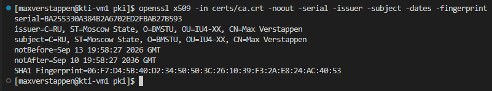

>[!NOTE]
>Может возникнуть соблазн просто открыть файл командой `cat certs/ca.crt` — в этом конкретном случае она даже покажет читаемую расшифровку полей сертификата. Но это не свойство формата, а особенность именно команды `openssl ca`: она дописывает текстовую расшифровку в начало создаваемого файла. Сертификат, полученный любым другим способом (скачанный, выпущенный сторонним УЦ, экспортированный из хранилища), состоит целиком из base64 — ровно как запрос на сертификат `ca.csr` чуть выше — и `cat` покажет лишь нечитаемый набор символов. Поэтому смотреть содержимое сертификата правильно всегда через `openssl x509` с нужным ключом из таблицы выше, а не полагаясь на то, что покажет `cat`.

Теперь займёмся сертификатом веб-сервера. Для начала создадим конфигурационный файл `webserver_req.cnf`. На данном этапе важно обратить внимание на значение поля `CN` (Common Name). В этом поле необходимо указать доменное имя или IP-адрес ВМ, иначе субъект проверки не будет соответствовать предъявляемому сертификату. В секции `alt_names` задают дополнительные доменные имена и IP-адреса.

```bash
vi webserver_req.cnf
```

```conf
[ req ]
default_bits = 2048
encrypt_key = no
default_md = sha256
prompt = no
utf8 = yes
distinguished_name = webserver_dn
req_extensions = webserver_ext

[ webserver_dn ]
C = RU
ST = Moscow State
L = Moscow
O = BMSTU
OU = IU4-XX
CN = 192.168.126.128

[ webserver_ext ]
subjectAltName = @alt_names

[alt_names]
IP.1 = 192.168.126.128
DNS.1 = max-verstappen.local
```

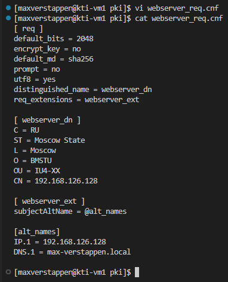

При помощи следующей команды создадим и закрытый ключ веб-сервера, и запрос на сертификат веб-сервера (да-да, одной командой сразу!):

```bash
openssl req -new -nodes -keyout webserver.key -out certs/webserver.csr -config webserver_req.cnf
```

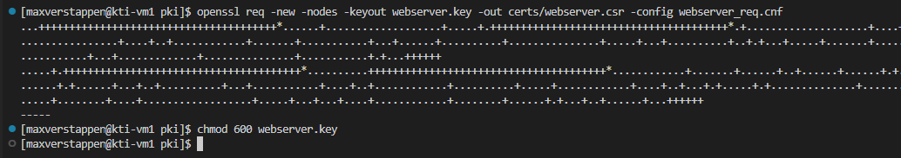

>[!NOTE]
>Обратите внимание на пути. Ключ УЦ мы генерировали командой `openssl genrsa -out ./private/ca.key`, то есть он лежит в `~/pki/private/`. А здесь ключ веб-сервера создаётся ключом `-keyout webserver.key` — без указания каталога, поэтому он окажется прямо в `~/pki/`, рядом с конфигами, а не в `private/`. Это важно помнить: чуть ниже мы будем копировать его в каталог NGINX именно оттуда.

Закроем доступ к ключу веб-сервера так же, как к ключу УЦ:

```bash
chmod 600 webserver.key
```

Далее следует выпустить сертификат веб-сервера, подписанный закрытым ключом удостоверяющего центра, сделать это можно при помощи команды:

```bash
openssl ca -in certs/webserver.csr -out certs/webserver.crt -config ca.cnf -extensions server_cert
```

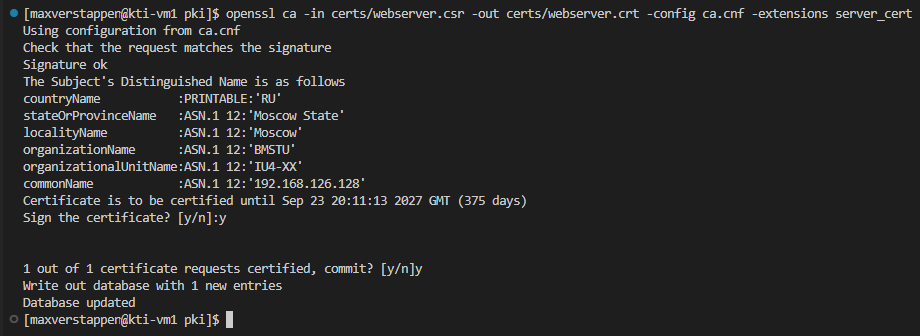

Посмотрим на поля сертификата веб-сервера командой:

```bash
openssl x509 -in certs/webserver.crt \
    -noout -serial -issuer \
    -subject -dates -fingerprint \
    -ext subjectAltName
```

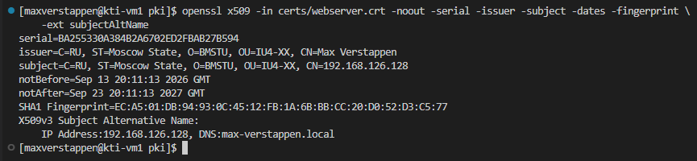

Атрибут `X509v3 Authority Key Identifier` — идентификатор ключа УЦ, которым подписан сертификат. Другими словами, по этому полю можно определить, действительно ли сертификат подписан конкретным удостоверяющим центром. Чтобы посмотреть именно это расширение, воспользуемся ключом `-ext` из таблицы выше — он выведет только запрошенное расширение:

```bash
openssl x509 -in certs/webserver.crt -noout -ext authorityKeyIdentifier
```

```bash
openssl x509 -in certs/ca.crt -noout -ext subjectKeyIdentifier
```

Заодно убедимся, что цепочка доверия сходится и сертификат веб-сервера действительно проверяется по сертификату УЦ:

```bash
openssl verify -CAfile certs/ca.crt certs/webserver.crt
```

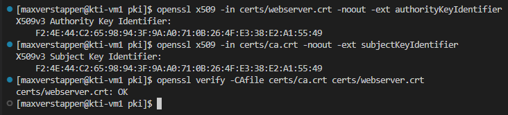

В ответ должно прийти `certs/webserver.crt: OK`. Если вместо этого выводится ошибка — значит, сертификат подписан не тем ключом или файлы перепутаны.

Осталось отредактировать конфигурационный файл NGINX, где указать параметры TLS и пути к сертификатам. Предварительно создадим необходимые каталоги и файлы.

В `/etc/nginx/` создадим папку `ssl`. В ней создадим `dhparam.pem` — файл с ключевой информацией для поддержки технологии **Forward Secrecy**. Эта технология позволяет не допустить расшифровку трафика TLS-сессии даже при компрометации закрытого ключа сервера.

```bash
sudo mkdir /etc/nginx/ssl
```

Сгенерируем `dhparam.pem` следующей командой:

```bash
sudo openssl dhparam -out /etc/nginx/ssl/dhparam.pem 4096
```

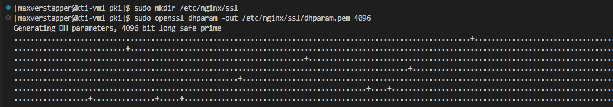

>Генерация может занять некоторое время, за которое можно успеть перекусить.
>
>

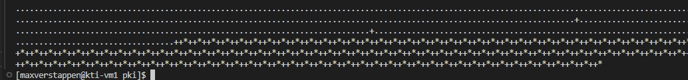

Теперь скопируем в каталог `ssl` сертификат и закрытый ключ веб-сервера.

```bash
sudo cp ~/pki/certs/webserver.crt ~/pki/webserver.key /etc/nginx/ssl/
```

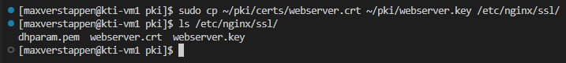

### Настройка веб-сервера и хоста
Хорошей практикой является размещение настроек TLS в отдельном файле (пусть он называется `ssl_params`, а находится в корневом каталоге конфигураций NGINX). Это позволит его переиспользовать в случае настройки нескольких сайтов.

```bash
sudo vi /etc/nginx/ssl_params
```

Содержимое файла ([ссылка на референс](https://ssl-config.mozilla.org/)):

```nginx
ssl_certificate ssl/webserver.crt;
ssl_certificate_key ssl/webserver.key;
ssl_session_timeout 1d;
ssl_session_cache shared:SSL:10m;

ssl_dhparam ssl/dhparam.pem;

ssl_protocols TLSv1.2 TLSv1.3;
ssl_ciphers ECDHE-ECDSA-AES128-GCM-SHA256:ECDHE-RSA-AES128-GCM-SHA256:ECDHE-ECDSA-AES256-GCM-SHA384:ECDHE-RSA-AES256-GCM-SHA384:ECDHE-ECDSA-CHACHA20-POLY1305:ECDHE-RSA-CHACHA20-POLY1305:DHE-RSA-AES128-GCM-SHA256:DHE-RSA-AES256-GCM-SHA384;
ssl_prefer_server_ciphers off;
```

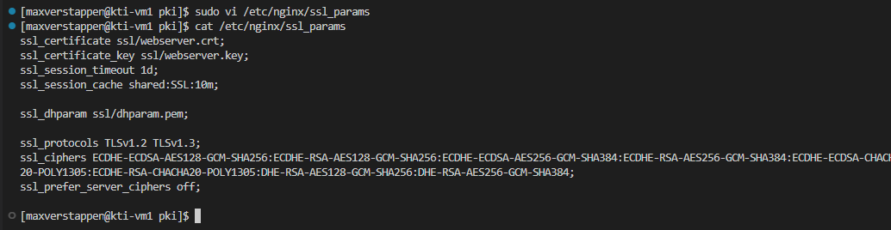

>[!NOTE]
>Директивы `ssl_certificate` и `ssl_certificate_key` указывают на расположение сертификата и закрытого ключа сервера, `ssl_protocols` - на используемые протоколы, `ssl_ciphers` – на наборы шифров, `ssl_dhparam` - путь к файлу `dhparam.pem`, сгенерированному немного ранее.
>
>Пути здесь записаны относительно местоположения `nginx.conf` — `ssl/webserver.crt`, а не `/etc/nginx/ssl/webserver.crt`. Абсолютные пути тоже допустимы.

Наконец, внесём изменения в конфиг NGINX:

```bash
sudo vi /etc/nginx/conf.d/flask_app.conf
```

```nginx
upstream flask_app {
    server 127.0.0.1:8000;
}

server {
    listen 80;
    server_name _;
    return 301 https://$host$request_uri;
}


server {
    listen 443 ssl;
    server_name _;
    include /etc/nginx/ssl_params;

    location / {
        proxy_set_header X-Forwarded-For $proxy_add_x_forwarded_for;
        proxy_set_header X-Forwarded-Proto $scheme;
        proxy_set_header Host $http_host;
        proxy_redirect off;
        proxy_pass http://flask_app;
    }
}
```

Прежде чем перезагружать NGINX, проверим конфигурацию на синтаксические ошибки — мы только что правили два файла, и опечатка в любом из них уронит веб-сервер:

```bash
sudo nginx -t
```

Только получив `syntax is ok` и `test is successful`, перезагружаем:

```bash
sudo nginx -s reload
```

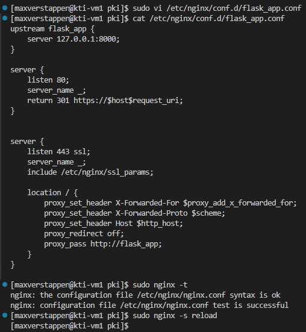

>[!TIP]
>Если сайт по HTTPS не открывается, а `nginx -t` при этом доволен, проверьте, открыт ли на ВМ порт 443:
>
>```bash
>sudo firewall-cmd --list-all
>```
>
>В списке `services` должен быть `https` — он добавлялся во второй лабораторной работе. Если его нет:
>
>```bash
>sudo firewall-cmd --add-service=https
>sudo firewall-cmd --runtime-to-permanent
>```

>[!NOTE]
>Создан новый виртуальный сервер на порту 80, а порт имеющегося изменён на 443. Предварительно заполненный файл `ssl_params` с настройками TLS подключен директивой `include`, в которой указан абсолютный путь к этому файлу.

Если прямо сейчас попытаться открыть сайт по HTTPS, браузер откажется загружать страницу и покажет ошибку — сертификат подписан нашим самодельным удостоверяющим центром, которому операционная система и браузер пока не доверяют:

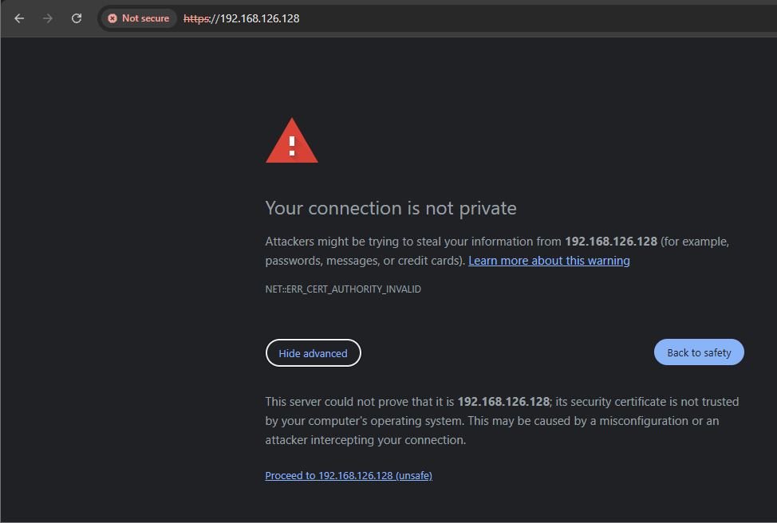

Чтобы избавиться от этой ошибки, нужно научить ОС хоста доверять нашему УЦ. Для этого установим сертификат УЦ (`ca.crt`) в хранилище доверенных корневых сертификатов. Скачаем файл сертификата на хост для его последующей установки.

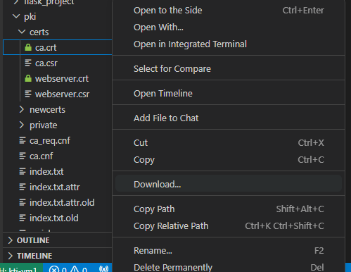

Откроем скачанный файл. В глаза бросается, что наша операционная система не доверяет данному сертификату.

>[!NOTE]
>Язык окна сертификата зависит от локализации ОС хоста — на скриншотах ниже он английский, у вас интерфейс может быть на русском (`Общие`, `Состав`, `Путь сертификации` и т.д. вместо `General`, `Details`, `Certification Path`). Суть и порядок действий от этого не меняются.

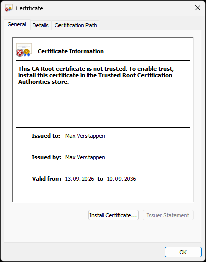

Во вкладках `Состав` (`Details`) и `Путь сертификации` (`Certification Path`) можно посмотреть более подробную информацию о сертификате.

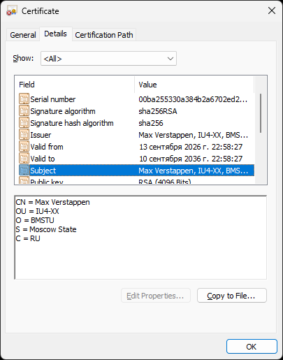

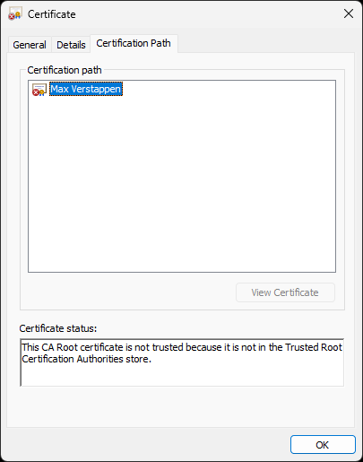

Чтобы ОС доверяла нашему сертификату, установим его в хранилище доверенных корневых сертификатов (кнопка `Установить сертификат...` (`Install Certificate...`) во вкладке `Общие` (`General`)):


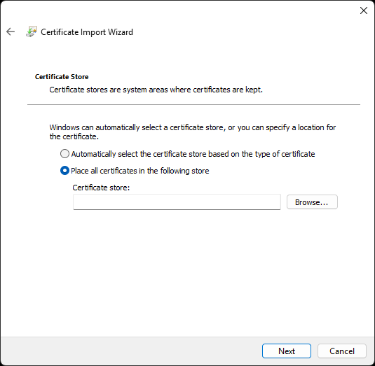

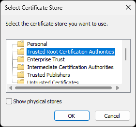

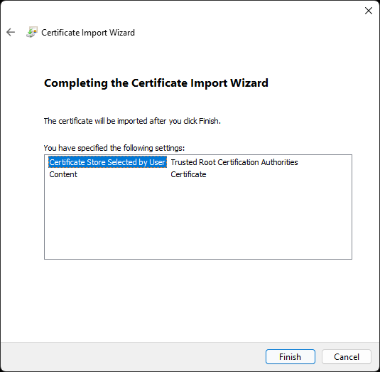

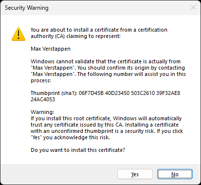

После установки ещё раз откроем сертификат на хосте.

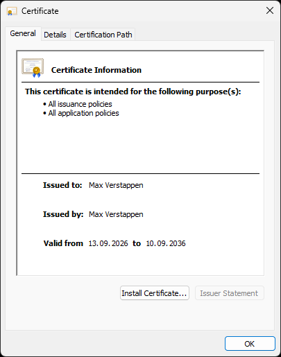

Теперь ОС хоста будет доверять всем сертификатам, подписанным закрытым ключом нашего импровизированного удостоверяющего центра.

Проверим работу сайта по протоколу HTTPS:

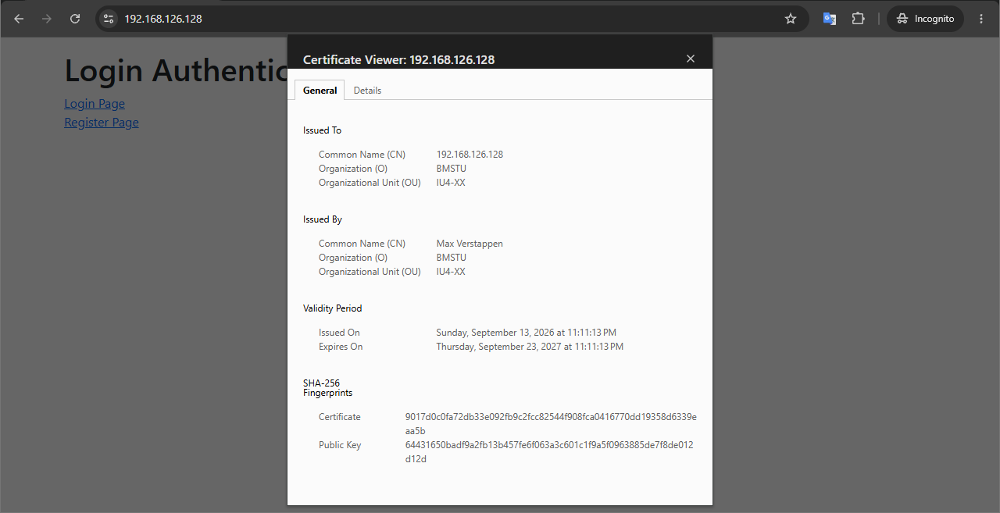

Видим значок, сигнализирующий о корректной проверке сертификата сайта браузером. Кликнув на него и выбрав соответствующий пункт в выпадающем меню, можно увидеть и сам сертификат.

>[!NOTE]
>Добавим пару слов про строчку в конфиге NGINX `return 301 https://$host$request_uri;`. Смысл этой настройки в том, чтобы принудительно направить браузер на HTTPS версию сайта, даже если пользователь пытается открыть его по HTTP. В таком случае сервер отправляет клиенту ответ с кодом `301` (Moved Permanently) и новым адресом. Браузер запоминает этот ответ и в следующий раз берёт его из кэша, сразу открывая HTTPS-версию.

Попытаемся намеренно открыть сайт по протоколу HTTP:

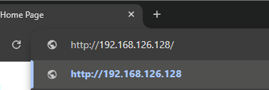

Открыв в браузере консоль разработчика (клавиша `F12`) и обратившись к сайту по HTTP, видим следующую картину:

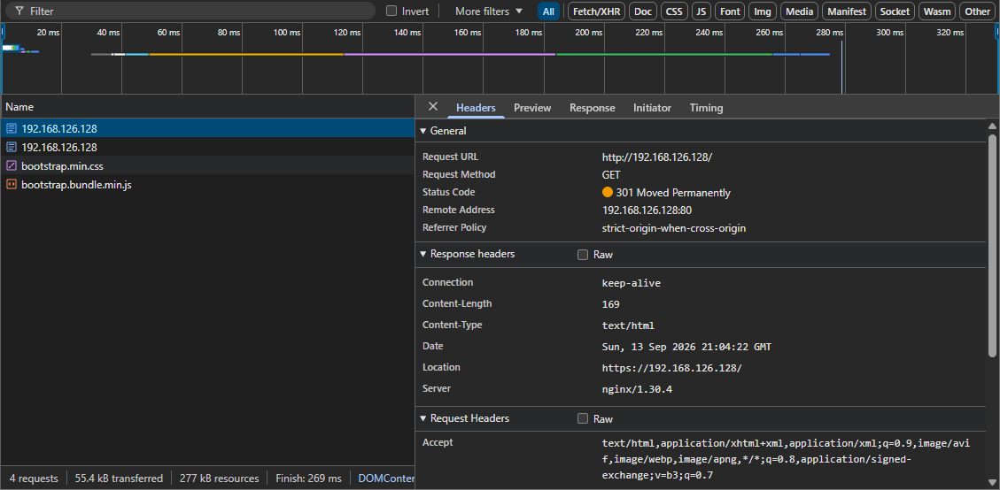

Если на хосте есть права администратора, можно провернуть ещё один фокус. Откроем файл `C:\Windows\System32\drivers\etc\hosts` и добавим в него строку с IP-адресом виртуальной машины и доменным именем, которое было добавлено в сертификат.

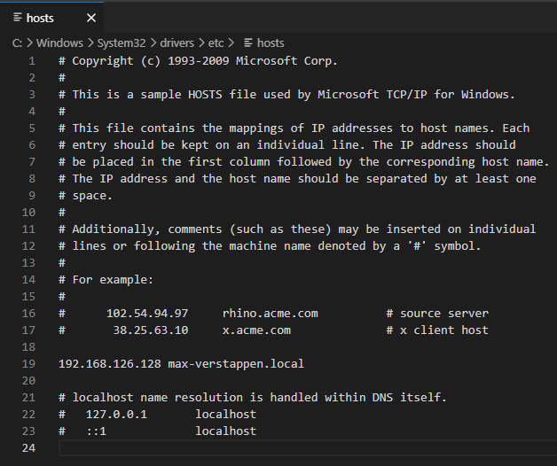

При попытке сохранить файл может появиться сообщение о том, что доступ запрещён. Следует нажать кнопку `Retry as Admin…`:


Если все выполнено верно, в браузере можно открыть сайт не по IP-адресу, а по доменному имени. Браузер считает подключение валидным, потому что доменное имя добавлено в расширения сертификата:

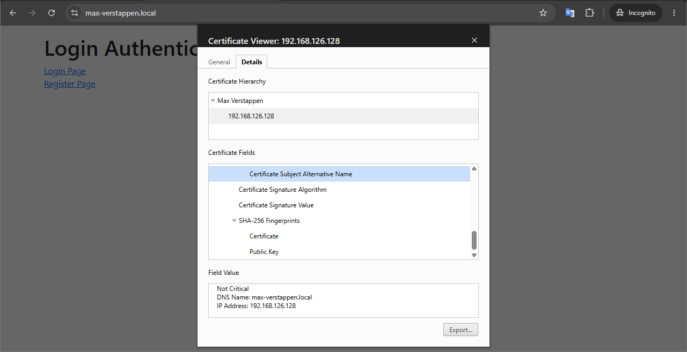

На данном этапе настроена инфраструктура открытых ключей, созданы сертификаты УЦ и веб-сервера, а сам веб-сервер настроен на работу по протоколу HTTPS.

Первая половина работы была о том, как защитить канал, по которому код попадает к пользователю. Вторая будет о том, как этот код хранить: чтобы можно было увидеть историю правок, вернуться к любой предыдущей версии и вести разработку нескольких функций параллельно. А в самом конце работы, при подключении к GitHub, снова пригодится асимметричная криптография — только уже не в виде сертификатов, а в виде пары SSH-ключей.

---

## Работа с Git
### Основы Git
>[!NOTE]
>При разработке ПО удобно хранить код в системе контроля версий. Это позволяет контролировать процесс разработки, оперативно откатываться к предыдущим версиям кода, распараллеливать разработку между несколькими людьми, в случае хранения кода во внешнем репозитории - иметь доступ к актуальной версии ПО из любого места с доступом в интернет. В данных лабораторных работах в качестве системы контроля версий выступает Git.

Проверить, установлен ли Git, а заодно узнать его версию можно командой `git -v` (то же самое делает и полная форма — `git --version`):

```bash
git -v
```

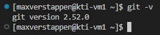

После установки необходимо выполнить настройки имени пользователя и почты для того, чтобы система могла указать правильные сведения об авторе изменений в файлах:

```bash
git config --global user.name "maxverstappen"
```

```bash
git config --global user.email "maxverstappen@f1.com"
```

Эти и другие настройки могут быть записаны в файл `~/.gitconfig`. Посмотреть его содержимое можно командой:

```bash
git config --list
```

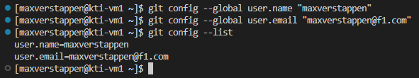

Для дальнейшей работы настроим окружение в каталоге `/usr/share/nginx/html/`, где расположим наш Git-репозиторий.

Сначала задаём нужные права доступа:

```bash
sudo chmod g+w /usr/share/nginx/html/
```

И меняем группу-владельца каталога `html` на `nginx`.

```bash
sudo chgrp nginx /usr/share/nginx/html/
```

Убедиться, что права и группа изменились, можно командой:

```bash
ls -hl /usr/share/nginx/
```

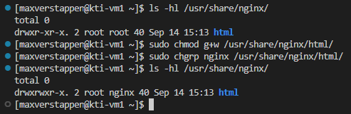

Затем добавляем текущего пользователя в группу `nginx`, чтобы он мог свободно работать с файлами.

```bash
sudo usermod -aG nginx $USER
```

Активируем это членство, обновив список групп пользователя:

```bash
newgrp nginx
```

Список групп, в которые входит пользователь, показывает команда `groups` — до и после выполненных команд он будет разным.

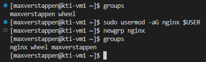

>[!NOTE]
>`newgrp` не меняет группы текущего сеанса, а запускает поверх него новый экземпляр оболочки, в котором членство уже учтено. Практических следствий два: текущий каталог может сброситься в домашний, а при повторном входе на ВМ (новое SSH-подключение, перезагрузка) команду выполнять уже не нужно — членство в группе к тому моменту применится само.

Создаём директорию `demo_project` для нового проекта и переходим в неё.

```bash
mkdir /usr/share/nginx/html/demo_project
```

```bash
cd /usr/share/nginx/html/demo_project
```

После всех приготовлений можем инициализировать локальный Git-репозиторий:

```bash
git init
```

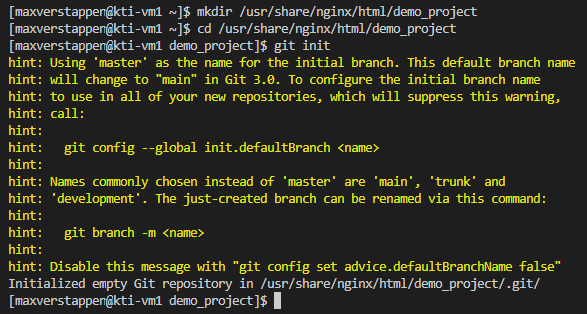

>[!NOTE]
>Вместе с сообщением об успешной инициализации Git выводит подсказку (`hint:`) о том, что именем начальной ветки выбрано `master`, а в Git 3.0 по умолчанию будет использоваться `main`. Это предупреждение, а не ошибка: репозиторий создан, и дальше мы работаем с веткой `master`. Убрать подсказку можно, явно задав имя начальной ветки: `git config --global init.defaultBranch master`.

После инициализации репозитория появилась скрытая папка `.git`, в которой находятся служебные файлы, относящиеся к Git:

```bash
ls -ahl
```

```bash
ls -ahl .git/
```

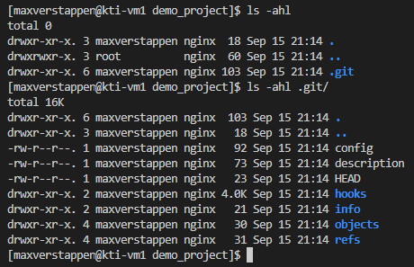

Проверить статус созданного репозитория можно командой:

```bash
git status
```

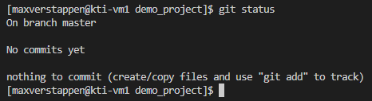

>[!NOTE]
>Строка `On branch master` показывает, в какой ветке (branch) мы сейчас находимся. Строка `No commits yet` говорит о том, что пока ещё нет ни одного коммита.

Создадим новый файл в нашем репозитории.

```bash
echo "# Description of the demonstration project" > README.md
```

Если мы снова посмотрим статус репозитория, то увидим, что созданный файл отображается, как `Untracked files`.

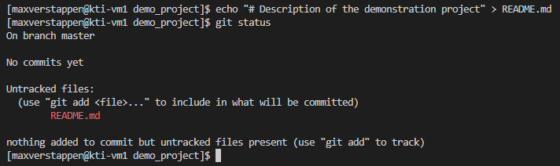

Для того, чтобы добавить `README.md` в перечень отслеживаемых Git файлов введём команду:

```bash
git add README.md
```

Теперь в статусе написано, что файл `README.md` добавлен и готов к коммиту.

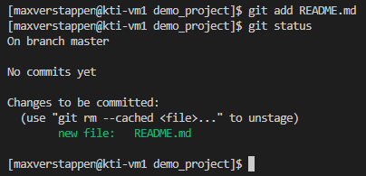

Теперь мы можем сделать наш первый коммит, то есть зафиксировать изменения, сделанные в нашем проекте.

>[!NOTE]
>Сообщения коммитов в этой работе оформлены по конвенции [Conventional Commits](https://www.conventionalcommits.org/): `<тип>: <описание>`, где тип — короткое слово, обозначающее характер изменения (`feat` — новая функциональность, `fix` — исправление ошибки, `docs` — документация, `style` — форматирование/стилизация, `refactor`, `test`, `chore` и др.), а описание пишется в повелительном наклонении и с маленькой буквы, без точки в конце (`add`, а не `added`). Такая единообразная форма упрощает чтение истории и позволяет автоматически генерировать changelog.

```bash
git commit -m "docs: add README with project description"
```

Сразу после коммита снова посмотрим статус — незафиксированных изменений больше нет.

```bash
git status
```

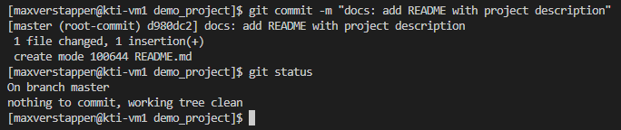

>[!NOTE]
>В выводе `git commit` отображена текущая ветка, номер нового коммита (на самом деле тут только первые 7 символов номера) и список изменений (файлов и строк кода). Номер коммита — это хэш по алгоритму SHA-1 файлов в проекте. То есть абсолютно одинаковые коммиты будут иметь одинаковые номера, что позволит Git знать об их идентичности. Пометка `root-commit` говорит о том, что это первый коммит в репозитории и родителя у него нет.

Посмотрим историю коммитов.

```bash
git log
```

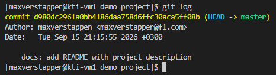

>[!NOTE]
>Вывод команды отображает информацию о коммитах в репозитории:
>- его уникальный хэш — `d980dc2961a0bb4186daa758d6ffc30aca5ff08b`;
>- ветка, на которую указывает `HEAD`, — `master`;
>- автор и его почта — `maxverstappen <maxverstappen@f1.com>`;
>- дата и время создания;
>- комментарий коммита.

Теперь внесём изменения в наш файл `README.md`.

```bash
vi README.md
```

Текст должен выглядеть так:

```markdown
# Description of the demonstration project

This is a demo project created to gain skills in working with Git.

---

Max Verstappen
```

Посмотреть, что получилось, можно командой `cat README.md`, после чего коммитим изменения.

```bash
git commit -am "docs: describe project purpose in README"
```

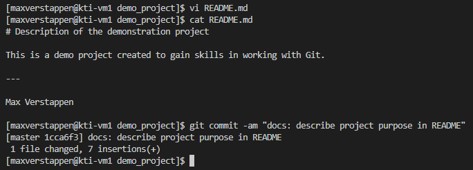

>[!NOTE]
>Ключ `-a` включает в коммит изменения всех уже отслеживаемых файлов, поэтому отдельная команда `git add` здесь не нужна. На новые файлы, которых Git ещё не видел, он не действует — их по-прежнему нужно добавлять вручную.

Теперь повторим эти действия, но удалим из файла `---`.

```bash
vi README.md
```

```markdown
# Description of the demonstration project

This is a demo project created to gain skills in working with Git.

Max Verstappen
```

Так же проверяем содержимое файла и коммитим изменения.

```bash
git commit -am "docs: remove horizontal separator from README"
```

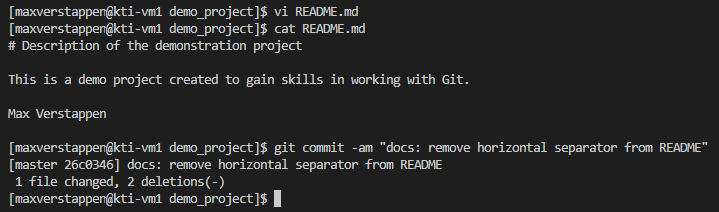

Посмотрим историю коммитов — теперь их три.

```bash
git log
```

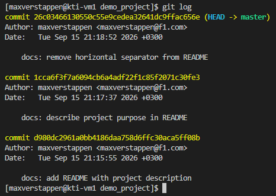

Давайте попробуем откатить изменения в нашем `README.md` до того момента, когда элемент `---` ещё не был удалён. Есть два варианта, как это сделать.

>[!NOTE]
>`git revert` — создаёт новый коммит, который отменяет изменения указанного предыдущего коммита, сохраняя историю изменений.  
>
>`git reset` — перемещает указатель ветки назад к указанному коммиту и может удалять коммиты из истории (в зависимости от режима: `--soft`, `--mixed`, `--hard`).

Давайте попробуем первый вариант. Отменить нужно последний коммит, а на него всегда указывает `HEAD`, поэтому хэш можно не выписывать:

```bash
git revert HEAD
```

>[!NOTE]
>Вместо `HEAD` можно передать конкретный коммит, взяв его идентификатор из вывода `git log` — например, `git revert 26c0346`. Хэши у всех будут свои, поэтому в методичке используется запись через `HEAD`: она не зависит от номеров коммитов и одинаково сработает у любого.

После этого у нас выскочит окно, в котором будет автоматически сгенерированный комментарий для коммита, генерируемого командой `git revert`. Его можно изменить, но в данном случае оставим всё по умолчанию. Выйти отсюда можно так же, как из Vi.

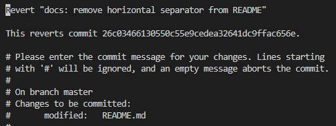

После выхода из редактора Git создаёт отменяющий коммит: в выводе видны его номер и две строки, вернувшиеся в файл.


Содержимое файла снова соответствует второму коммиту — тире вернулось на место.

```bash
cat README.md
```


Теперь воспользуемся вторым способом и вернёмся к коммиту `1cca6f3`, удалив все коммиты, следующие за ним.

```bash
git reset --hard HEAD~2
```

>[!NOTE]
>Запись `HEAD~2` означает «на два коммита назад от текущей позиции». Отсчитываем именно два, потому что после `git revert` в истории появились два лишних для нас коммита: тот, который удалял `---`, и тот, который это удаление отменил. Такая запись удобнее хэша тем, что не зависит от конкретных номеров коммитов и одинаково сработает у всех.
>
>Обратите внимание и на разницу в последствиях: `git revert` ничего не стирает и потому безопасен для веток, которые уже опубликованы, а `git reset --hard` переписывает историю и безвозвратно удаляет незакоммиченные изменения в рабочем каталоге.

Сравним, что получилось в истории и в самом файле.

```bash
git log --oneline
```

```bash
cat README.md
```


Наполнение файла не изменилось по сравнению с предыдущим шагом, но в истории не осталось ни коммита, удалявшего `---`, ни отменившего его коммита от `git revert`: репозиторий вернулся ровно в то состояние, в котором был после второго коммита.

### Принципы использования веток
>[!NOTE]
>Ветки в Git — это независимые линии разработки, позволяющие работать над разными частями проекта параллельно, независимо друг от друга. Каждая ветка сохраняет свою историю изменений, что даёт возможность изолированно разрабатывать новые функции, исправлять ошибки или экспериментировать, а затем безопасно интегрировать результаты в основную ветку (например, `master`).
>
>На этом этапе лабораторной работы создаётся базовая HTML-структура страницы в ветке `html_base`, от которой ответвляются две новые ветки: `css` (для стилей CSS) и `script` (для скрипта на страничке). Пока в них идёт работа, в саму `html_base` добавляется контейнер для скрытого сообщения, а затем `script` вливается обратно в `html_base` — на этом слиянии и возникает конфликт, который придётся разрешать вручную. Затем обновлённая `html_base` сливается с `master`, а вслед за ней — ветка `css`, что завершает сборку полной версии страницы.
>
>

Перед тем как приступить к работе с ветками, создадим ещё один конфигурационный файл NGINX.

```bash
sudo vi /etc/nginx/conf.d/demo_project.conf
```

В него добавим конфигурацию сервера, который будет работать на порту 8080:

```nginx
server {
    listen 8080;
    server_name _;

    location / {
        root   /usr/share/nginx/html/demo_project/html;
        index  index.html;
    }

    error_page   500 502 503 504  /50x.html;
    location = /50x.html {
        root   /usr/share/nginx/html;
    }
}
```

И ещё добавим порт `8080` в файрволл:

```bash
sudo firewall-cmd --add-port=8080/tcp
```

```bash
sudo firewall-cmd --runtime-to-permanent
```

>[!NOTE]
>Второй командой мы переносим правило из временной конфигурации в постоянную. Без неё открытый порт исчезнет при первой же перезагрузке ВМ, и работающая сегодня страница завтра перестанет открываться — по этой причине во второй лабораторной работе `runtime-to-permanent` шло после каждого изменения правил.

Проверим конфигурацию и перезагрузим NGINX.

```bash
sudo nginx -t
```

```bash
sudo nginx -s reload
```


>[!TIP]
>Если позже страница на порту `8080` будет отдавать ошибку `403 Forbidden`, а права на файлы при этом выглядят правильными, дело может быть в метках SELinux. Такое случается, если файлы сайта не создавать на месте, а перенести откуда-то командой `mv`: в отличие от копирования, перемещение сохраняет исходную метку файла, и NGINX теряет право его читать. Лечится восстановлением меток по умолчанию:
>
>```bash
>sudo restorecon -Rv /usr/share/nginx/html/
>```

В самом начале узнаем, какие ветки есть в репозитории. По умолчанию создаётся ветка `master` (как в нашем случае) или `main`.

```bash
git branch
```

Создадим новую (`-b`) ветку `html_base`, сразу переключимся на неё (`git checkout`) и снова посмотрим список веток:

```bash
git checkout -b html_base
```

```bash
git branch
```


При повторном просмотре списка веток видно `html_base`, `*` указывает на выбранную в данный момент ветку.

Создадим директорию `html`, а в ней файл `index.html`.

```bash
mkdir html
```

```bash
vi html/index.html
```

Наполнение `index.html`:

```html
<!DOCTYPE html>
<html lang="en">
<head>
    <meta charset="UTF-8">
    <meta name="viewport" content="width=device-width, initial-scale=1.0">
    <title>Max</title>
</head>
<body>
    <h1>Learning Through KTI Labs</h1>
    <p>Laboratory work helps turn theory into practical knowledge. Each experiment builds skills and deepens understanding.</p>
    <p>Prepare, observe, analyze, and reflect. This is how expertise grows.</p>
</body>
</html>
```


Закоммитим изменения.

```bash
git add html/index.html
```

```bash
git commit -m "feat: add base HTML page"
```


Теперь мы можем открыть эту страничку в браузере (по `http`):


Из ветки `html_base` сделаем 2 новых.

```bash
git branch css && git branch script
```

И перейдём в `script`:

```bash
git checkout script
```


И добавим в конец `body` скриптик:

```bash
vi html/index.html
```

```html
<!DOCTYPE html>
<html lang="en">
<head>
    <meta charset="UTF-8">
    <meta name="viewport" content="width=device-width, initial-scale=1.0">
    <title>Max</title>
</head>
<body>
    <h1>Learning Through KTI Labs</h1>
    <p>Laboratory work helps turn theory into practical knowledge. Each experiment builds skills and deepens understanding.</p>
    <p>Prepare, observe, analyze, and reflect. This is how expertise grows.</p>
    
    <script>
        const encoded =
            "Ly8gRm9sbG93IHRoZSB3aGl0ZSByYWJiaXQuLi4KLy8gU3lzdGVtIG" +
            "luaXRpYWxpemVkLi4uCi8vIEtub3dsZWRnZTogOTcuMyUKLy8gV2VsY2" +
            "9tZSB0byB0aGUgcmVhbCB3b3JsZC4KLy8gVGhlcmUgaXMgbm8gc3Bvb24u";

        let seq = '';
        document.addEventListener('keydown', e => {
            seq = (seq + e.key.toUpperCase()).slice(-6);
            if (seq === 'MATRIX') {
                document.getElementById('matrixCode').textContent = atob(encoded);
                document.getElementById('matrixCode').style.display = 'block';
                setTimeout(() => {
                    document.getElementById('matrixCode').style.display = 'none';
                }, 8000);
            }
        });
    </script>
</body>
</html>
```


Закоммитим.

```bash
git commit -am "feat: add matrix easter egg script"
```


Теперь перейдём в `css`:

```bash
git checkout css
```

Можно заметить, что здесь нет изменений, которые мы внесли в ветке `script`.


Добавим в `head` описание стилей:

```bash
vi html/index.html
```

```html
<!DOCTYPE html>
<html lang="en">
<head>
    <meta charset="UTF-8">
    <meta name="viewport" content="width=device-width, initial-scale=1.0">
    <title>Max</title>
    <style>
        body {
            font-family: 'Segoe UI', system-ui, sans-serif;
            max-width: 600px;
            margin: 40px auto;
            padding: 0 20px;
            line-height: 1.6;
            color: #333;
            background-color: #fafafa;
        }
        h1 {
            text-align: center;
            margin-bottom: 24px;
            color: #2c3e50;
            font-weight: 500;
        }
        p {
            margin-bottom: 16px;
            color: #555;
        }
        .matrix {
            display: none;
            font-family: monospace;
            color: #0f0;
            background: #000;
            padding: 16px;
            margin-top: 20px;
            border-radius: 4px;
            box-shadow: 0 2px 8px rgba(0,0,0,0.1);
        }
    </style>
</head>
<body>
    <h1>Learning Through KTI Labs</h1>
    <p>Laboratory work helps turn theory into practical knowledge. Each experiment builds skills and deepens understanding.</p>
    <p>Prepare, observe, analyze, and reflect. This is how expertise grows.</p>
</body>
</html>
```


Снова коммитим.

```bash
git commit -am "style: add page CSS styling"
```

>[!NOTE]
>Строго по конвенции тип `style` относится к изменениям, не влияющим на поведение кода (пробелы, отступы, форматирование), а не к добавлению самих визуальных стилей — формально это скорее `feat`. На практике `style` для CSS-правок используют довольно часто, но это не общепринятый стандарт, а скорее сложившаяся привычка — в реальных проектах стоит сверяться с конвенцией, принятой в конкретной команде.


Если посмотреть нашу страничку в браузере, то можно увидеть, что её внешний вид изменился.


Теперь вернёмся в ветку `html_base`:

```bash
git checkout html_base
```

При этом в браузере страничка откатится к первоначальному состоянию.


Внесём изменения в HTML-код:

```bash
vi html/index.html
```

```html
<!DOCTYPE html>
<html lang="en">
<head>
    <meta charset="UTF-8">
    <meta name="viewport" content="width=device-width, initial-scale=1.0">
    <title>Max</title>
</head>
<body>
    <h1>Learning Through KTI Labs</h1>
    <p>Laboratory work helps turn theory into practical knowledge. Each experiment builds skills and deepens understanding.</p>
    <p>Prepare, observe, analyze, and reflect. This is how expertise grows.</p>
    
    <div class="matrix" id="matrixCode"></div>
</body>
</html>
```


И закоммитим изменения.

```bash
git commit -am "feat: add container for hidden message"
```


Попробуем слить ветку `script` в `html_base`, для этого, находясь в ветке `html_base`, пропишем:

```bash
git merge script
```


Слияние остановилось на конфликте: строка `<div class="matrix" id="matrixCode"></div>`, которую мы добавили в `html_base`, находится в том же месте файла, что и блок `<script>` из ветки `script`. Git видит две разные правки одного участка и не может решить, какую оставить, поэтому передаёт решение нам.

Откроем файл с помощью текстового редактора.

```bash
vi html/index.html
```


Можем заметить появившиеся строки с `<<<<<<< HEAD`, `=======` и `>>>>>>> script`. Это автоматически генерируемые Git строки, указывающие на область конфликта: между `<<<<<<< HEAD` и `=======` находится вариант из текущей ветки (`html_base`), между `=======` и `>>>>>>> script` — вариант из вливаемой ветки (`script`). Можем выбрать один из вариантов или оставить оба — в зависимости от задачи. В данном случае оставим оба добавляемых блока, а сами маркеры удалим. Приведём файл к состоянию, как на скриншоте ниже:


После чего фиксируем результат слияния:

```bash
git commit -a
```

>[!NOTE]
>Здесь `git commit` намеренно вызывается без `-m`: при завершении слияния Git сам подставляет текст сообщения (`Merge branch 'script' into html_base`) и открывает редактор, чтобы его можно было дополнить.

Откроется редактор с уже готовым сообщением коммита и служебными комментариями о конфликте:


Оставляем всё как есть и выходим из Vi так же, как раньше — `:wq`. На этом слияние закончено.


Переключимся в ветку `master` и вольём в неё ветку `html_base`, а потом ветку `css`.

```bash
git checkout master
```

```bash
git merge html_base
```

```bash
git merge css
```


И в итоге всех наших действий получаем целостный файл с кодом странички:


Сама страничка будет выглядеть так:


Мы можем посмотреть структуру веток при помощи команды:

```bash
git log --oneline --graph
```


Это может выглядеть не очень наглядно, поэтому мы можем установить расширение `Git Graph`:


После чего можем посмотреть на структуру веток с красивым интерфейсом.


>[!NOTE]
>В реальных проектах, особенно при работе в команде, важно придерживаться единой стратегии управления ветками, чтобы избежать хаоса и упростить написание кода. Одной из популярных таких стратегий является **Gitflow** — модель ветвления, предложенная Винсентом Дриссеном в 2010 году для проектов с плановыми релизами. Она закрепляет за каждой веткой свою роль: `master` (или `main`) хранит только то, что уже выпущено в продакшен; `develop` — основная ветка разработки, в которую вливается готовый код; `feature/*` — ветки для разработки отдельных функций проекта; `release/*` — ветки подготовки релиза; `hotfix/*` — срочные исправления того, что уже работает у пользователей. Первые две ветки живут постоянно, остальные три создаются под конкретную задачу и удаляются после слияния.
>
>
>
>Цикл работы выглядит так. Новая функция начинается с ответвления от `develop` и по готовности вливается обратно в `develop` — похоже на то, что мы только что делали с ветками `css` и `script`, только с более строгими правилами именования и слияния. Когда накопленного в `develop` хватает на очередную версию, от неё отводится `release/*`: в этой ветке не добавляют функциональность, а только исправляют найденные ошибки и готовят выпуск, при этом работа над следующими функциями в `develop` не останавливается. Готовый релиз сливается в `master`, и на коммит слияния вешается тег с номером версии (`v1.2.0`). Если же ошибка обнаружилась в том, что уже работает у пользователей, ждать следующего релиза не нужно: ветка `hotfix/*` ответвляется прямо от `master` и после исправления сливается обратно тем же порядком, с новым тегом (`v1.2.1`).
>
>Обратите внимание на стрелки, идущие от `master` к `develop`. После каждого релиза и каждого хотфикса тегированный коммит `master` сливается обратно в `develop`. Иначе исправление, сделанное в обход `develop`, пропадёт в следующем релизе, а тег не попадёт в историю ветки разработки. Последнее важнее, чем кажется: команда `git describe --tags`, выполненная в `develop`, не найдёт версию, у которой нет тегированного предка, и инструментам автоматического версионирования (например, GitVersion) придётся определять номер версии по косвенным признакам.
>
>Gitflow подходит не всем: модель рассчитана на продукт с версиями и плановыми релизами. Для сервисов, которые выкатываются по несколько раз в день, чаще берут более лёгкие схемы — GitHub Flow или trunk-based development, где долгоживущая ветка всего одна. Но принцип остаётся общим: набор веток и правила их слияния должны быть определены заранее и одинаково поняты всей командой.

### Использование GitHub
>[!NOTE]
>[GitHub](https://github.com) — это облачная платформа для хостинга Git-репозиториев, которая позволяет разработчикам не только хранить и резервировать код, но и эффективно сотрудничать при работе над общими проектами. С помощью GitHub можно делиться кодом с другими, отслеживать изменения, обсуждать задачи, проверять предложения по улучшению через **Pull Request** и автоматизировать процессы сборки и тестирования.

Зайдём на страницу [GitHub](https://github.com) и войдём в свой аккаунт. Если аккаунта ещё нет, создадим его, нажав `Sign up`.

>[!WARNING]
>На данный момент регистрация на GitHub возможна только с использованием VPN.


>Интересный факт: эти методички тоже хранятся на GitHub, поэтому вы можете скачать их на свои компьютеры с помощью Git и хранить локально, главное — периодически их обновлять. А ещё вы можете поставить звёздочку этому репозиторию :)

Заполним форму регистрации (либо войдём через Google/Apple, либо укажем почту, пароль, имя пользователя и страну):


GitHub отправит код подтверждения на указанную почту — введём его, чтобы завершить регистрацию:


После подтверждения почты откроется дашборд аккаунта — на нём есть кнопка `Create repository`, с помощью которой создадим новый репозиторий:


Создаём публичный репозиторий с названием `KTI_demo_project`:


После этого нас перенаправит на страницу репозитория.


Нажмём на `SSH` — и GitHub любезно предоставит нам команды для подключения нашего локального репозитория к удалённому.


Теперь в консоли нашей ВМ введём:

```bash
git remote add origin git@github.com:Porfik/KTI_demo_project.git
```

>[!WARNING]
>`Porfik` — имя аккаунта из примера. Подставьте своё: проще всего скопировать готовую строку прямо со страницы репозитория, как на предыдущем скриншоте.

Проверим добавление в ваш локальный Git-репозиторий удалённого репозитория.

```bash
git remote -v
```

А дальше переименовываем ветку, в которой мы находимся (`master`), в `main`. `main` — имя главной ветки по умолчанию в GitHub: именно его платформа подставляет в подсказки на странице нового репозитория. Чтобы локальный и удалённый репозитории не разъезжались по именам веток, переименуем свою главную ветку так же:

```bash
git branch -M main
```


Чтобы взаимодействовать с GitHub, нам нужно, чтобы он мог нас идентифицировать. Будем использовать для этого SSH ключи. Сгенерируем их:

```bash
ssh-keygen -t ed25519
```


Скопируем содержимое `id_ed25519.pub`:

```bash
cat ~/.ssh/id_ed25519.pub
```


Перейдём в настройки аккаунта GitHub и выберем вкладку `SSH and GPG keys`.


И добавляем новый SSH ключ.


После этого мы можем загрузить наш репозиторий на GitHub.

```bash
git push -u origin main
```


Как видим, всё успешно загрузилось. Инструментарий GitHub также позволяет вносить изменения в файлы прямо через веб-интерфейс — для этого нажмём на значок карандаша рядом с `README`:


Внесём какие-нибудь изменения в файл `README.md` и закоммитим их, нажав на соответствующую кнопку.


Теперь синхронизируем изменения на GitHub с нашим локальным репозиторием:

```bash
git pull
```


Как видим, изменения синхронизировались.


В ходе работы выпущены сертификаты удостоверяющего центра и веб-сервера, настроен доступ к сайту по протоколу HTTPS, получены базовые навыки работы с Git и GitHub.
